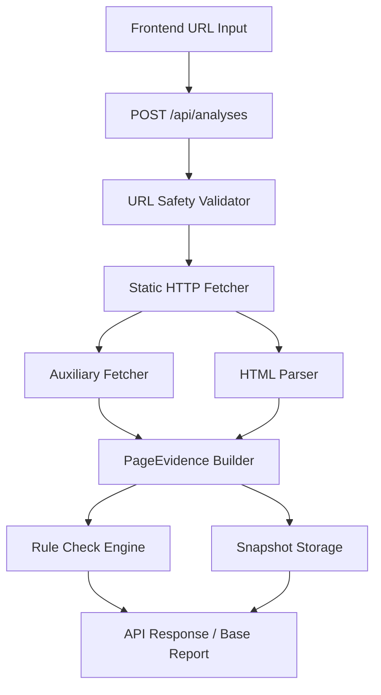
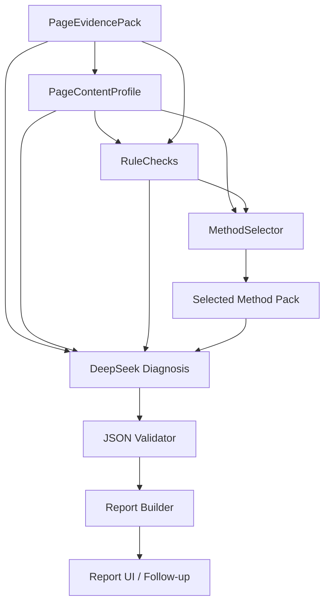

# GEO 实施路线与架构决策

状态：active  
最后更新：2026-06-17  
依赖文档：`GEO项目总纲.md`

## 1. 当前架构结论

当前项目应采用：

> Single-URL Page Evidence Pipeline -> PageContentProfile -> RuleChecks -> MethodSelector -> DeepSeek Diagnosis -> Validator

但当前实现阶段只要求先落地前两段：

> Single-URL Page Evidence Pipeline -> RuleChecks

这里的 `PageContentProfile` 是目标架构中的 GEO 抽象层；当前不把它作为独立模块前置，但 Page Evidence v1 和 RuleChecks v1 必须为它的字段口径预留空间。没有高质量页面证据，后面的 GEO 抽象、MethodSelector、DeepSeek、追问和报告都会变成不稳定的上层建筑。

## 2. GEO 模块嵌入原则

所有模块都必须嵌入同一套 GEO 语义，而不是只传递通用网页字段：

| 模块 | 必须承载的 GEO 语义 |
|---|---|
| Fetcher / URL Safety | `selection_readiness` 的访问、安全和重定向边界 |
| Parser / Content Blocks | macro / meso / micro 结构、可复用 answer units 的原始证据 |
| Structured Data | schema 类型、属性完整性、与可见内容一致性 |
| PageEvidence Builder | 稳定 `evidence_ref`、字段来源、主内容置信度 |
| PageContentProfile | `page_type`、`primary_entity`、claim/evidence、selection/absorption readiness |
| Rule Engine | 将 GEO 维度转成确定性 finding 和 failure_type |
| MethodSelector | 根据 page_type、failure_type、asset_type、evidence_level 选方法 |
| DeepSeek Diagnosis | 只基于结构化事实和方法卡片做归纳，不创造事实 |
| Validator | 校验 `evidence_ref`、`method_ref`、JSON schema 与安全边界 |

## 3. 当前目标架构



当前正式主链路中，不把下列模块设为前置：

- 向量检索。
- 双模型调用。
- 浏览器渲染。
- 队列系统。
- 复杂数据库落库。

## 4. 后续完整架构

在 Page Evidence v1 稳定后，再按顺序接入：



## 5. 核心决策

### 5.1 先完整做 `page_evidence`

`apps/api/app/page_evidence` 是当前唯一完整模块优先级。理由已经被代码现状和开发状态共同证明：

- `POST /api/analyses` 已完成同步单 URL 分析闭环。
- `PageEvidencePack v1`、`RuleChecks v1`、snapshot 与 API base report 已冻结。
- 当前公开 API 已冻结为 `page_evidence + page_content_profile(minimal public subset) + rule_checks + snapshot_dir`，完整内部 `PageContentProfile` 不对外暴露。

因此当前不应把主精力转到 DeepSeek、RAG 或复杂前端。

### 5.2 抓取层采用“自控安全边界 + 成熟解析库”

当前推荐策略：

```text
URL safety 自研
+ httpx 静态抓取
+ selectolax DOM 提取
+ trafilatura 正文提纯
+ extruct 结构化数据提取
```

原因：

- SSRF、安全校验、重定向验证必须由我们自己控制。
- HTML 主体提取、DOM 遍历、结构化数据提取不必重复造轮子。
- 这样能把复杂度放在真正的产品边界，而不是重复实现通用解析算法。

当前阶段补充：

- `selectolax` 先作为 DOM 提取正式实现接入，替换临时标准库 parser。
- `parser.py` 继续只承担 DOM 字段、links、images、tables、基础内容块和 JSON-LD script 收集。
- `extruct` 负责 embedded structured data extraction。
- `trafilatura` 负责 clean markdown / main content extraction。
- 解析栈按 `selectolax -> extruct -> trafilatura` 的顺序增量接入，service 与 schema 尽量保持稳定。

### 5.3 Page Evidence v1 默认静态 HTML，不默认浏览器

当前不把 Playwright 或外部抓取服务设为默认路径。

原因：

- 当前最紧迫的问题不是“任何页面都抓到”，而是“已抓到的页面要稳定、安全、可追踪”。
- 动态渲染会立刻引入成本、时延、指纹、隔离和运维复杂度。
- 很多页面在静态 HTML 下已经足够提取 metadata、schema、heading 和主内容。

何时升级：

- 真实样本反复出现“静态 HTML 主体为空，但浏览器可见正文存在”的情况。
- 这种失败已经影响 Page Evidence v1 的目标样本覆盖率。

### 5.4 Page Evidence v1 先落调试快照，不先依赖数据库

当前决定：

> Page Evidence v1 先以文件快照为主，数据库落库不是前置条件。

建议产物：

```text
data/analyses/{analysis_id}/
  raw.html
  clean.md
  evidence.json
  rule_checks.json
```

原因：

- 当前仓库数据库 migration 仍未本地验证。
- Page Evidence v1 的主要需求是调试、可追踪和 fixture 对比，不是复杂查询。
- 文件快照更适合快速迭代 evidence schema。

何时升级：

- 需要跨分析查询、历史对比、用户级持久化或多实例共享状态时，再引入数据库主存储。

### 5.5 MethodSelector 先于复杂 RAG

当前决定：

> 在方法规模仍可人工维护时，先用种子卡片加 deterministic selector，不默认上 pgvector。

推荐输入：

- `page_type`
- `failure_types`
- `asset_needs`
- `language`

推荐选择逻辑：

```text
固定 base methods
+ page_type 过滤
+ failure_type 过滤
+ asset_type 过滤
+ 少量关键词补充
```

何时升级为向量检索：

- 种子卡片规模明显增长。
- metadata filter + 关键词召回已无法稳定命中 golden queries。
- 需要更强语义召回且有明确评估基线。

### 5.6 DeepSeek 放在事实、GEO 抽象与方法之后

DeepSeek 的正确位置是：

```text
PageEvidencePack + PageContentProfile + RuleChecks + Selected Methods -> DeepSeek Diagnosis
```

不推荐的路径：

- `URL -> DeepSeek`
- `raw HTML -> DeepSeek`
- `PageEvidencePack -> DeepSeek GeoSemanticReadout -> 再做全部主链路`

说明：

- `GeoSemanticReadout` 可以作为未来研究项。
- 当前主链路先不引入第二次模型调用。
- 模型应当消费已经整理好的事实和方法，而不是替代事实层。

### 5.7 当前先同步执行，不引入外部队列

当前 `POST /api/analyses` 可以先同步执行或使用轻量 background task。

何时升级：

- 分析耗时已持续影响用户体验。
- 需要并发排队、重试、作业监控和取消能力。

在这些信号出现前，不引入消息队列。

## 6. 模块边界

### 6.1 `apps/api/app/page_evidence`

当前建议目录：

```text
page_evidence/
  models.py
  errors.py
  url_safety.py
  fetcher.py
  parser.py
  structured_data.py
  content_blocks.py
  rule_checks.py
  storage.py
  service.py
```

职责：

- URL 校验和 DNS/IP 安全判断。
- 主 HTML 抓取和辅助文件抓取。
- metadata / schema / 正文 / 内容块提取。
- `PageEvidencePack` 构建。
- `RuleChecks` 生成。
- 快照落盘。
- 为后续 `PageContentProfile` 提供 page type、entity、claim/evidence、structure、schema alignment 的稳定原始信号。

当前内部设计约束：

- `parser.py` 是 DOM extraction module，不负责 HTTP、规则判断或快照写入。
- `service.py` 继续作为编排层，不感知 `selectolax` 具体选择器细节。
- `structured_data.py` 统一承接 `extruct` 输出，并向 `PageEvidencePack` 映射稳定 evidence refs。

### 6.2 `apps/api/app/page_profile` 或 `page_evidence/abstraction.py`

后续建议目录：

```text
page_profile/
  models.py
  builder.py
```

或在早期以 `page_evidence/abstraction.py` 形式存在。

职责：

- 从 `PageEvidencePack` 生成 `PageContentProfile`。
- 识别 `page_type`、`primary_entity`、`search_intent`。
- 产出 `answer_units`、`claim_candidates`、`evidence_candidates`、`statistics`。
- 计算 `selection_readiness` 与 `absorption_readiness` 的输入信号。

当前约束：

- 不用 DeepSeek 生成该层事实。
- 不把 raw HTML、隐藏文本或 comments 作为可信输入。
- 每个抽象字段都必须能回到 `evidence_ref`。

### 6.3 `apps/api/app/methods`

后续目录建议：

```text
methods/
  models.py
  selector.py
  geo_methods.seed.json
```

职责：

- 维护种子方法卡片。
- 根据页面问题选择相关方法。
- 输出稳定 `method_ref`。

### 6.4 `apps/api/app/diagnosis`

后续目录建议：

```text
diagnosis/
  models.py
  prompt_builder.py
  deepseek_client.py
  validator.py
  service.py
```

职责：

- DeepSeek JSON 输出。
- schema 校验。
- 无效 JSON 重试与降级。

### 6.5 `apps/api/app/reports`

职责：

- 组装 API 返回视图。
- 区分事实、推断和未知项。
- 后续为前端提供 evidence/method 展开视图。

## 7. Page Evidence v1 目标

必须完成：

- 只允许 `http` / `https`。
- 拦截 localhost、私网、回环、链路本地、metadata IP、保留地址。
- 手动验证每一跳重定向目标。
- 限制超时、重定向次数和响应体大小。
- 拒绝非 HTML 主响应。
- 提取 title、description、canonical、lang、headings、links、images、tables、JSON-LD。
- 并发抓取 robots.txt、sitemap.xml、llms.txt、llms-full.txt。
- 为字段和内容块生成稳定 `evidence_ref`。
- 输出基础规则报告。
- 为后续 GEO 抽象保留主内容置信度、schema 类型、结构层级、claim/evidence 线索。

## 8. 升级触发条件

### 8.1 何时加数据库

- 需要持久保存分析历史。
- 需要跨分析查询或聚合。
- 需要多用户、多实例共享状态。

### 8.2 何时加 pgvector

- 方法卡片规模增长到手工 selector 明显失效。
- 已有 golden queries 证明当前召回不足。
- 需要语义检索而不是简单规则过滤。

### 8.3 何时加动态页面 fallback

- 静态 HTML 在目标样本中频繁失真。
- 失真页面对业务价值较高。
- 已有可靠的隔离、超时和成本控制方案。

### 8.4 何时加队列

- 同步分析已明显拖慢接口体验。
- 需要可见排队、重试和后台执行。

## 9. 当前不采用

- 不把 Postgres + pgvector 写成当前主链路前置依赖。
- 不把 `GeoSemanticReadout` 写成当前必经步骤。
- 不把 Playwright、Firecrawl、Dify、RAGFlow、FastGPT 写成核心实现依赖。
- 不让模型替代 URL 抓取、解析和规则判断。
- 不为了未来扩展提前拆微服务。

## 10. 实施顺序

### Phase 1

- Page Evidence v1
- RuleChecks v1
- `/api/analyses` 基础报告
- 为 `PageContentProfile v1` 固化必要 evidence 字段

### Phase 2

- PageContentProfile v1
- GeoMethod seed cards
- MethodSelector v0
- `method_ref` 贯通

### Phase 3

- DeepSeek Diagnosis
- JSON Validator
- 资产草案与追问

### Phase 4

- 数据库存储
- 向量检索
- 动态页面 fallback
- 历史分析与监控
