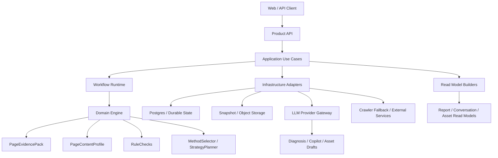

# GEO 实施路线与架构决策

状态：active
最后更新：2026-06-28
依赖文档：`GEO项目总纲.md`

## 1. 本文档角色

本文件是正式系统蓝图。它回答：

- 系统按什么层次组织。
- 哪些上下文是核心，哪些是外围。
- 业务状态由谁拥有。
- 长任务应如何拆分。
- 当前架构如何演进到长期产品形态。

它不负责记录“今天具体做完了什么”，这些内容一律交给 `DEVELOPMENT_STATUS.md`。

## 2. 架构结论

长期正确架构不是“一个大 service + 若干路由 + 一个模型 client”，而是：

```text
Product API
+ Application Use Cases
+ Workflow Runtime
+ Deterministic GEO Domain Engine
+ Infrastructure Adapters
+ Stable Read Models
```

简化表达：

```text
FastAPI Product API
+ durable state
+ workflow orchestration
+ deterministic GEO engine
+ guarded LLM gateway
+ report and copilot read models
```

## 3. 分层模型



### 3.1 Product API

职责：

- 对外 contract
- auth / permission boundary
- error shape
- pagination / filtering / idempotency boundary

约束：

- 不直接编排底层解析或模型细节。
- 不直接写 snapshot 文件。

### 3.2 Application Use Cases

职责：

- `CreateAnalysisJob`
- `GetAnalysisReport`
- `GenerateDiagnosis`
- `SendCopilotMessage`
- `ManageProviderConfig`

约束：

- 只协调 domain、workflow、repository、gateway。
- 不承担领域计算细节。

### 3.3 Workflow Runtime

职责：

- 多步骤状态
- 恢复与重试
- streaming / human-in-the-loop
- traceable execution

约束：

- 只编排，不重写领域规则。
- 只在持久状态和 use case 边界明确后引入更复杂 runtime。

### 3.4 Domain Engine

职责：

- 页面事实提取
- GEO 抽象
- 规则判断
- 方法选择
- 策略规划
- safe prompt 构建

约束：

- 不 import FastAPI、数据库 session 或具体 LLM SDK。
- 领域对象应可单元测试、fixture 测试和离线回放。

### 3.5 Infrastructure Adapters

职责：

- DB repository
- job worker / queue
- object storage
- provider gateway
- dynamic crawl fallback
- observability adapters

约束：

- 可替换，不污染领域模型。

## 4. 核心上下文划分

长期看，系统至少应包含以下上下文：

| 上下文 | 责任 | 说明 |
|---|---|---|
| `analysis` | intake、evidence、profile、rules | 页面分析主链路 |
| `methods` | method pack、selector、strategy | 方法与修复路径 |
| `diagnosis` | safe prompt、structured diagnosis | 面向报告的结构化模型输出 |
| `conversations` | copilot thread、turn validation、history | 面向解释与追问的对话层 |
| `reports` | issue/action/asset/report read model | 用户消费层，不等于内部 artifact |
| `llm` | provider config、gateway、usage、trace | 模型接入与治理 |
| `jobs` | durable state machine、claim、retry、recovery | 长任务执行与恢复 |
| `projects` | workspace、project、site、history | 产品化工作台状态 |

规则：

- `analysis` 是领域入口。
- `reports` 是用户主输出。
- `conversations` 依附于 `analysis` / `reports`，不应反客为主。
- `llm` 是共享基础设施，而不是业务主上下文。

## 5. 数据所有权

长期可持续产品必须区分三类数据：

### 5.1 业务状态

应由数据库持有：

- user / workspace / project / site
- analysis index and status
- jobs
- conversation threads and messages
- provider configs
- eval runs

### 5.2 大型分析产物

应由 snapshot / object storage 持有：

- raw HTML
- clean markdown
- evidence artifacts
- profile artifacts
- methods / strategy / safe prompt artifacts
- diagnosis artifacts

### 5.3 用户消费读模型

应由 application 层从业务状态与 artifact 组装：

- analysis report
- issue cards
- action plan
- asset draft view
- copilot thread view

规则：

- 数据库是业务状态事实源。
- artifact storage 是调试与回放源。
- read model 是面向产品界面的衍生层。

## 6. 工作流边界

### 6.1 AnalyzePage Workflow

长期职责：

```text
validate input
-> acquire page
-> parse page
-> build profile
-> run rules
-> select methods
-> plan strategy
-> build safe prompt
-> persist artifacts and state
-> optionally build report read model
```

### 6.2 Diagnosis Workflow

长期职责：

```text
load safe prompt
-> call structured llm
-> validate output
-> repair / retry policy
-> persist diagnosis
-> update report read model
```

### 6.3 Copilot Workflow

长期职责：

```text
load conversation state
-> route intent
-> build conversation safe pack
-> call structured llm
-> validate turn
-> persist turn
-> refresh thread read model
```

### 6.4 Report Workflow

长期职责：

```text
load analysis bundle
-> compile issue/action/asset cards
-> export markdown/json/pdf
-> persist report artifacts
```

### 6.5 Site Workflow

后期职责：

```text
discover urls
-> batch analyses
-> aggregate site insights
-> compare trends
-> schedule re-checks
```

## 7. 公开 contract 策略

### 7.1 对外只暴露稳定 read model

公开 API 应尽量提供：

- analysis summary
- report view
- methods / strategy read views
- conversation history
- asset drafts

不要把所有内部中间对象直接暴露给前端拼装。

### 7.2 内部 artifact 可以版本化演进

允许内部 artifact 逐步增强，但要求：

- schema 版本清晰
- round-trip 可验证
- 不直接破坏公开 contract

### 7.3 任何 LLM 输出都不是公开 contract 的直接事实源

模型输出必须先经过：

1. schema validation
2. business validation
3. read model compilation

之后才能进入公开产品界面。

## 8. 演进路线

### Phase A：产品化地基

目标：

- 明确数据库与 artifact 的状态边界
- job state machine 成为统一长任务机制
- provider config、conversation、analysis history 有稳定持久层
- 开始收敛 report read model

### Phase B：工作流拆分

目标：

- 把大 service 内的多步骤过程抽成 workflow-friendly steps
- 每一步有稳定输入输出对象
- 为 durable workflow runtime 做好边界准备

### Phase C：报告优先

目标：

- 报告成为前端主产品面
- methods / strategy / diagnosis 不再由前端散拼
- Copilot 成为报告解释层

### Phase D：项目化与站点化

目标：

- 引入 workspace / project / site 视角
- 批量输入、比较和再分析

### Phase E：可恢复 workflow runtime

目标：

- 在有明确长任务恢复、流式进度和人审压力后，引入 LangGraph 或等价 runtime

## 9. 架构规则

为保证长线可维护性，所有后续改动都应遵守：

1. 先建清晰边界，再引框架。
2. 先收敛 read model，再优化界面交互。
3. 先有 durable state 和 eval，再做 agent 化。
4. 任何新能力都不能绕开 evidence-first 主链路。
5. 任何新文档都不能和 `DEVELOPMENT_STATUS.md` 重复维护当前状态。

## 10. 相关文档

- `GEO项目总纲.md`：产品定义与不变量
- `GEO架构技术栈与工具整合建议.md`：技术采用门禁
- `模块开发补充/商业产品化重构与Agent架构方案.md`：长期产品化和 LangGraph 增量引入补充方案
