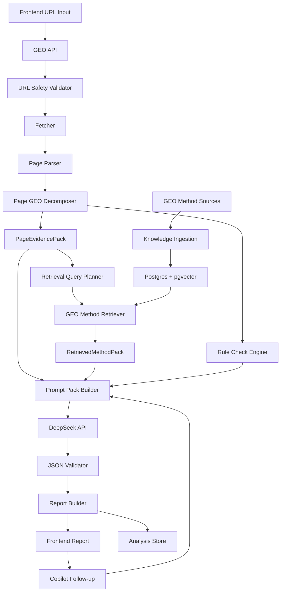

# GEO 实施路线与架构决策

状态：active  
最后更新：2026-06-14  
依赖文档：`GEO项目总纲.md`

## 1. 当前最终架构

本项目采用：

> Single-URL Page Decomposer + GEO Method RAG + DeepSeek Feedback API

也就是：

```text
URL
-> Page GEO Decomposer
-> Rule Checks
-> GEO Method Retriever
-> Prompt Pack Builder
-> DeepSeek JSON Diagnosis
-> Report + Copilot Follow-up
```

这个架构的关键是：DeepSeek 输出质量由 **页面证据包 + 检索到的 GEO 方法包 + 短 system prompt + JSON schema** 共同约束。

## 2. 核心决策

### 2.1 知识库必须进入主链路

GEO 方法知识库不是后续增强，而是 DeepSeek 输出反馈的前置依赖。

如果没有方法检索，DeepSeek 容易输出泛泛建议；如果有方法检索，DeepSeek 可以把反馈绑定到具体做法：

- 页面缺 Product schema -> 检索 schema 方法和模板。
- 页面缺证据 -> 检索 claim-evidence 方法。
- 页面段落不可引用 -> 检索 citability 方法。
- 页面被 AI bot 阻挡 -> 检索 crawler access 方法。
- 页面没有 answer-ready summary -> 检索 summary block 模板。

### 2.2 默认选 `Postgres + pgvector`

当前决策：

```text
Primary DB: Postgres
Vector search: pgvector
Keyword search: Postgres full-text search
Embedding: BAAI/bge-m3 or equivalent multilingual local embedding
Generator/Judge: DeepSeek API
```

理由：

- 第一阶段知识规模小，Postgres 足够。
- pgvector 可以把向量、metadata、版本、分析记录放在同一事务数据库里。
- 混合检索可以同时按 page_type、failure_type、method_type 过滤。
- BGE-M3 适合中文需求 + 英文论文/开源文档的混合语料。

后续迁移条件：

- method chunks 超过几十万。
- 多租户客户知识库需要强隔离和高并发检索。
- 需要复杂 payload filtering、实时索引和独立向量服务。

满足这些条件再评估 Qdrant。

### 2.3 Page Evidence 不进入通用 RAG

用户页面内容不是第一阶段的长期知识库语料。

页面内容应先变成结构化 `PageEvidencePack`：

- 便于引用字段。
- 便于控制 token。
- 便于 DeepSeek 不编造。
- 便于 UI 展示证据。

只有分析历史和用户确认后的策略结果，才进入长期 `Analysis Memory`。

## 3. 总体架构



## 4. 模块设计

### 4.1 URL Safety Validator

职责：

- 只允许 `http` / `https`。
- DNS 解析后拦截私网、回环、链路本地、metadata IP。
- 限制重定向次数。
- 限制响应大小。
- 限制超时。
- 拒绝非 HTML 主响应。

这是安全边界，不能交给模型。

### 4.2 Fetcher

职责：

- 获取 HTML。
- 获取 `/robots.txt`。
- 获取 `/sitemap.xml`。
- 获取 `/llms.txt` 和 `/llms-full.txt`。
- 记录 final URL、状态码、headers、抓取时间。

默认不使用浏览器。只有 HTML 正文为空或疑似 SPA 时，才使用 Playwright fallback。

### 4.3 Page Parser

职责：

- 提取 meta。
- 提取 headings。
- 提取正文。
- 提取 JSON-LD。
- 提取 links、image alt、table、list、FAQ、procedure。

推荐工具：

- `httpx`
- `selectolax` 或 `BeautifulSoup`
- `trafilatura` 或 readability 类库
- `extruct`

### 4.4 Page GEO Decomposer

职责：

把页面拆成 GEO 诊断字段。

输出：

- `metadata`
- `crawl_access`
- `schema`
- `entity_signals`
- `content_blocks`
- `claim_candidates`
- `evidence_candidates`
- `citability_candidates`
- `rule_check_inputs`

关键逻辑：

1. 按标题层级切分正文块。
2. 识别定义、主张、证据、统计、FAQ、步骤、对比块。
3. 标记每个块的 `block_id`，供反馈引用。
4. 保留短 excerpt，不把整页原文塞给 DeepSeek。

### 4.5 Rule Check Engine

规则检查负责确定性判断。

第一版检查：

- title 缺失或过短。
- meta description 缺失。
- H1 缺失或多个 H1。
- robots.txt 缺失或阻挡 AI bots。
- sitemap 缺失。
- llms.txt 缺失。
- 初始 HTML 正文不足。
- JSON-LD 缺失。
- schema 类型不匹配页面。
- sameAs 缺失。
- claim 无 evidence。
- 缺 FAQ / summary / statistics。

规则结果会进入 DeepSeek 输入，作为事实基础。

### 4.6 GEO Method Retriever

职责：

从知识库检索和当前页面问题相关的方法。

检索输入：

```json
{
  "page_type": "product",
  "detected_failures": ["missing_product_schema", "weak_evidence"],
  "target_assets": ["json_ld", "faq", "answer_summary"],
  "language": "zh-CN"
}
```

检索策略：

1. 固定取 `base_rubric`。
2. 按 `page_type` 过滤。
3. 按 `failure_type` 过滤。
4. 向量召回 top 20。
5. full-text 召回 top 20。
6. 合并去重。
7. 按 trust_level、匹配字段、freshness 排序。
8. 输出 top 8-12 个 chunks。

### 4.7 Prompt Pack Builder

职责：

组装 DeepSeek 输入：

```text
SYSTEM_PROMPT
TASK
PAGE_EVIDENCE
RULE_CHECKS
GEO_METHODS
OUTPUT_SCHEMA
```

要求：

- system prompt 必须短。
- 详细规则来自 GEO_METHODS。
- 每个 method chunk 带 `method_ref`。
- 每个 page block 带 `evidence_ref`。
- 输出 JSON schema 必须稳定。

### 4.8 DeepSeek Client

职责：

- 使用 DeepSeek chat completion。
- 默认模型 `deepseek-v4-flash`。
- 高价值或失败重试升级 `deepseek-v4-pro`。
- 设置 `response_format: {"type": "json_object"}`。
- 记录 model、usage、latency、finish_reason。

失败策略：

1. JSON 无效 -> 原模型重试一次。
2. 仍无效 -> 升级模型重试一次。
3. 仍失败 -> 返回规则检查报告和 `ai_diagnosis_failed`。

### 4.9 JSON Validator

职责：

- 校验 DeepSeek 输出。
- 检查必填字段。
- 检查每条 issue/action 是否有 `evidence_ref` 和 `method_ref`。
- 检查 score 是否在 0-100。
- 检查是否有禁止措辞，如“保证排名提升”。

### 4.10 Report Builder

职责：

- 把规则检查和 DeepSeek JSON 合并为前端报告。
- 分离事实、推断、未知项。
- 输出可复制资产草案。

## 5. System Prompt

采用短 system prompt：

```text
You are GEO Copilot, a strict page-audit engine. Use only PAGE_EVIDENCE and GEO_METHODS. If evidence is missing, write unknown. Return valid JSON only. Every issue and action must cite evidence_ref and method_ref. Prioritize crawl access, entity clarity, schema, citability, support, and answer-ready structure. Do not invent facts or promise rankings.
```

不要把长规则写进 system。长规则放入知识库并通过 retrieval 进入 `GEO_METHODS`。

## 6. 数据模型

### 6.1 method_documents

| 字段 | 含义 |
|---|---|
| `id` | 文档 ID |
| `source_type` | paper / repo / internal / template |
| `title` | 标题 |
| `source_url` | 来源链接 |
| `trust_level` | high / medium / low |
| `version` | 版本 |
| `created_at` | 创建时间 |

### 6.2 method_chunks

| 字段 | 含义 |
|---|---|
| `id` | chunk ID |
| `document_id` | 文档 ID |
| `chunk_text` | 方法文本 |
| `method_type` | rubric / strategy / template / warning |
| `page_type` | product / article / docs / landing / comparison / generic |
| `failure_type` | missing_schema / weak_evidence / poor_structure 等 |
| `asset_type` | faq / json_ld / summary / llms_txt / checklist |
| `tags` | 标签 |
| `embedding` | pgvector |
| `created_at` | 创建时间 |

### 6.3 analyses

| 字段 | 含义 |
|---|---|
| `id` | 分析 ID |
| `input_url` | 输入 URL |
| `final_url` | 最终 URL |
| `status` | queued / running / completed / failed |
| `language` | 输出语言 |
| `created_at` | 创建时间 |
| `completed_at` | 完成时间 |
| `error_code` | 错误码 |

### 6.4 page_evidence_packs

| 字段 | 含义 |
|---|---|
| `analysis_id` | 分析 ID |
| `evidence_json` | 页面证据包 |
| `raw_html_path` | 原始 HTML 路径 |
| `clean_text_path` | 清洗正文路径 |
| `created_at` | 创建时间 |

### 6.5 retrieval_traces

| 字段 | 含义 |
|---|---|
| `analysis_id` | 分析 ID |
| `query_json` | 检索查询 |
| `retrieved_chunk_ids` | 命中 chunks |
| `scores_json` | 检索得分 |
| `created_at` | 创建时间 |

### 6.6 diagnoses

| 字段 | 含义 |
|---|---|
| `analysis_id` | 分析 ID |
| `model` | DeepSeek 模型 |
| `prompt_pack_json` | 输入摘要 |
| `response_json` | 原始 JSON |
| `validated_report_json` | 校验后报告 |
| `usage_json` | token usage |
| `created_at` | 创建时间 |

## 7. API 设计

### 7.1 创建分析

```http
POST /api/analyses
```

```json
{
  "url": "https://example.com/product",
  "language": "zh-CN",
  "business_type": "b2b_saas",
  "target_keywords": ["AI search visibility"]
}
```

### 7.2 查询分析

```http
GET /api/analyses/{analysis_id}
```

返回分析状态、报告、证据摘要和检索方法引用。

### 7.3 追问

```http
POST /api/analyses/{analysis_id}/messages
```

追问时复用：

- 当前 `PageEvidencePack`。
- 当前 `DeepSeekDiagnosis`。
- 必要时重新检索 `GEO_METHODS`。

### 7.4 方法知识入库

```http
POST /api/admin/method-documents
```

第一版可以先做脚本，不一定暴露 UI。

## 8. 实施路线

### Phase 1：页面拆解 + 规则报告

目标：

- URL 安全校验。
- 页面抓取。
- 页面 GEO 拆解。
- 规则检查。
- 无 DeepSeek 时也能输出基础报告。

### Phase 2：GEO 方法知识库

目标：

- 建 `method_documents` / `method_chunks`。
- 导入论文、公开项目、内部 rubric。
- 生成 embedding。
- 实现 hybrid retrieval。

### Phase 3：DeepSeek Prompt Pack

目标：

- system prompt。
- task instruction。
- evidence pack。
- retrieved methods。
- JSON schema。
- DeepSeek JSON 输出和校验。

### Phase 4：Copilot 追问和资产生成

目标：

- 基于当前分析追问。
- 生成 FAQ、JSON-LD、summary、llms.txt 条目。
- 每个资产绑定 evidence_ref 和 method_ref。

## 9. 当前不采用

- 不让 DeepSeek 直接访问网页。
- 不把整页 HTML 直接塞进模型。
- 不做真实 AI 搜索网页端采样。
- 不做多 agent 编排。
- 不用 Dify / n8n 承载核心逻辑。
- 不先上 Qdrant，除非 pgvector 达到规模瓶颈。

## 10. 外部依据

- [DeepSeek API Docs](https://api-docs.deepseek.com/)：OpenAI/Anthropic 兼容 API、`deepseek-v4-flash` / `deepseek-v4-pro`、JSON Output。
- [pgvector](https://github.com/pgvector/pgvector)：Postgres 内的向量相似度搜索。
- [Qdrant Documentation](https://qdrant.tech/documentation/)：后续可选独立向量数据库。
- [BAAI/bge-m3](https://huggingface.co/BAAI/bge-m3)：多语言、多粒度 embedding 候选。
