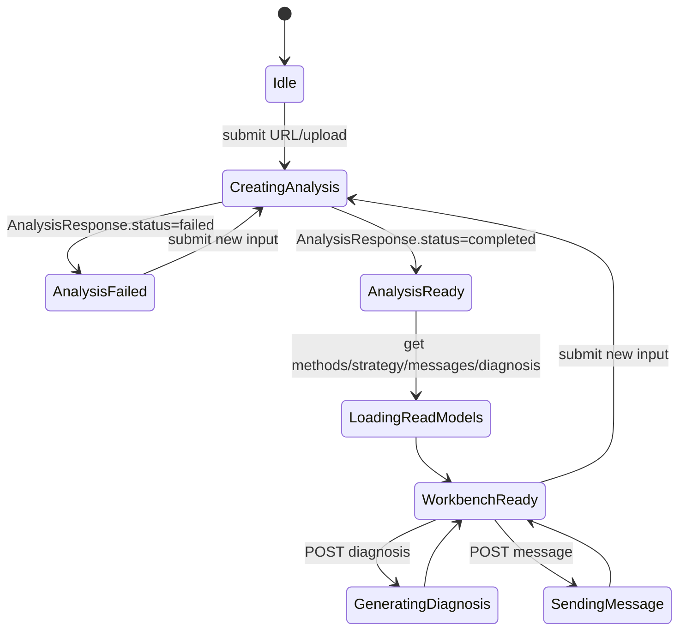

# 前端页面与接口对接开发方案

状态：ready-for-frontend-page-implementation
最后更新：2026-06-22
适用范围：`apps/web` 前端页面、GEO Copilot Workbench、FastAPI 接口联调、前端 HTML/CSS 展示层收口
当前基线：本地 `main` 已完成前端接口 / 数据 / 功能层最小闭环；后续重点是把现有功能稳定呈现到前端页面，并完成真实后端浏览器联调与响应式验收。

## 1. 当前结论

当前不再按“从静态页开始接接口”推进。`apps/web` 已经具备可运行的 `GEO Copilot Workbench` 雏形，后续前端组员应在这个基线上做页面呈现、交互状态、错误态、响应式和浏览器联调。

本阶段目标：

- 保留现有 API client、类型、response guards、hook 和组件拆分。
- 把 URL 分析、上传分析、provider 配置、diagnosis、methods、strategy、Copilot Chat 和 asset drafts 都稳定展示到页面。
- 用 HTML/CSS 完成清晰可用的工具型页面表达；本文不规定美术风格，不输出视觉稿。
- 完成真实 API 联调、移动端 / 桌面端验收和必要的 smoke check。

本阶段不做：

- 不重做后端 contract。
- 不引入完整报告页、PDF 导出、账号系统、多项目空间、RAG 管理页或流式响应。
- 不让前端直接调用 DeepSeek / OpenAI-compatible provider。
- 不读取 `snapshot_dir` 本地路径，不渲染 raw HTML，不使用 `dangerouslySetInnerHTML` 展示页面内容。
- 不把 assistant-ui、AI SDK、TanStack Query、Zod、shadcn/ui 作为本轮必须引入的依赖；如要替换现有手写状态/校验，应单独评估。

## 2. 已验证本地状态

当前 `apps/web` 已完成：

- `app/page.tsx` 已渲染 `GeoCopilotWorkbench`，首屏是工具界面，不是营销页。
- `types/api.ts` 已定义前端会显示和会提交的 API 类型，包括 analysis、methods、strategy、diagnosis、conversation、provider config。
- `lib/api-client.ts` 已统一封装以下接口：
  - `POST /api/analyses`
  - `POST /api/analyses/uploads`
  - `GET /api/analyses/{analysis_id}`
  - `GET /api/analyses/{analysis_id}/methods`
  - `GET /api/analyses/{analysis_id}/strategy`
  - `GET /api/analyses/{analysis_id}/diagnosis`
  - `POST /api/analyses/{analysis_id}/diagnosis`
  - `GET /api/analyses/{analysis_id}/messages`
  - `POST /api/analyses/{analysis_id}/messages`
  - `GET /api/llm/provider`
  - `PUT /api/llm/provider`
  - `DELETE /api/llm/provider`
  - `POST /api/llm/provider/test`
- `lib/api-guards.ts` 已提供最小运行时 response guards；当前没有引入 Zod。
- `hooks/use-geo-copilot.ts` 已封装 workbench 状态、operation flags、read model 并行加载、diagnosis 生成、message 发送、provider 保存/测试/清除。
- `components/geo-copilot/` 已拆出基础组件：
  - `workbench`
  - `analysis-intake`
  - `upload-intake`
  - `analysis-summary`
  - `rule-check-list`
  - `methods-panel`
  - `strategy-panel`
  - `diagnosis-panel`
  - `copilot-thread`
  - `asset-draft-panel`
  - `provider-config-panel`
  - `ref-chip`
- `app/globals.css` 已有基础 grid、表单、badge、ref chip、三栏布局和移动端断点。

当前仍未完成：

- 未完成正式页面呈现收口：信息密度、模块层级、空态、加载态、错误态仍需系统整理。
- 未完成真实 API + Web 浏览器联调记录。
- 未完成移动端 / 桌面端完整检查。
- 未完成前端自动化 smoke test。
- 未完成 provider 错误态、diagnosis 404/422/502/503、chat provider error 的页面验收样本。
- 未完成 asset drafts 在复杂返回下的可读性验收。

## 3. 外部项目参考口径

外部优秀项目只作为结构参考，不作为本项目架构迁移要求。

| 来源 | 已验证信号 | 可借鉴点 | 本项目取舍 |
| --- | --- | --- | --- |
| [assistant-ui/assistant-ui](https://github.com/assistant-ui/assistant-ui) | GitHub 页面显示约 10.7k stars；README 说明其提供 `Thread`、`Message`、`Composer`、`ActionBar` 等 composable primitives，并支持 custom backend。 | Chat UI 分层、message / composer / action bar 的组件边界。 | 只参考组件分层。当前后端返回非流式 `CopilotTurn` JSON，不需要本轮接入 assistant-ui runtime。 |
| [vercel/chatbot](https://github.com/vercel/chatbot) | README 定位为 Next.js + AI SDK chatbot template，并包含 App Router、shadcn/ui、数据持久化、Auth.js 等能力。 | 对话产品的信息组织、pending/error UX、artifact panel 思路。 | 不复制其 provider、DB、auth、stream route；本项目模型调用和校验归 FastAPI。 |
| [shadcn-ui/ui](https://github.com/shadcn-ui/ui) | README 说明其是可定制、可扩展、用于构建本地组件库的组件集合。 | 可访问组件、copy-owned component library 的治理思路。 | 本轮不强制引入。若团队采用，应单独做 Tailwind/shadcn setup，避免和业务联调混在一起。 |
| [TanStack Query](https://tanstack.com/query/latest/docs/framework/react/overview) | 官方文档强调其用于 fetching、caching、synchronizing、updating server state。 | 后续可替代手写 server state / mutation state。 | 当前 hook 已能支撑 demo；是否引入应看复杂度，不作为页面收口前置条件。 |
| [Zod](https://zod.dev/) | 官方文档说明其是 TypeScript-first schema validation。 | 后续可替代手写 response guards，提高 schema 可维护性。 | 当前 `api-guards.ts` 已够 v0 使用；是否迁移 Zod 应独立处理。 |

## 4. 前端交付边界

### 4.1 必须交付

- URL 分析表单：URL、language、business type、target keywords。
- 上传分析表单：单文件 `.html/.htm/.txt/.md`，declared URL 和业务上下文。
- 当前 analysis 摘要：status、input URL、final URL、title、canonical、page type、primary entity、selection / absorption readiness、prompt injection risk、structured data alignment。
- 规则检查列表：按 failed、warning、passed 和 severity 排序；展示 `rule_id`、`finding`、`failure_type`、`recommendation`、`evidence_refs`。
- Methods 面板：展示 selected methods、why selected、matched rules/failures/evidence refs、expected artifacts、guardrails。
- Strategy 面板：展示 strategy steps、rank、why now、method refs、validator requirements。
- Diagnosis 面板：支持 GET 空态、POST 生成、score、issues、priority actions、unknowns、asset drafts、validator warnings。
- Copilot Thread：支持历史读取、发送问题、pending 状态、assistant answer、refs、unknowns、follow-up suggestions。
- Provider Config 面板：支持保存、测试、清除；API key 不回显明文。
- Ref chip：evidence/method/rule/action refs 可复制或聚焦；长 ref 不撑破布局。
- 统一错误态：network、HTTP 4xx、HTTP 5xx、contract guard、analysis failed、provider error、validator error。
- 响应式：桌面三栏，窄屏不横向溢出，必要时按输入 / 对话 / 证据分区堆叠或切换。

### 4.2 明确不交付

- 完整报告页。
- 导出 PDF。
- 批量 URL 分析。
- 前端本地历史持久化。
- 可发布 Copilot actions。
- 直接展示 snapshot 文件。
- 模型 token streaming。
- 前端调用第三方模型 API。

## 5. 页面信息架构

第一屏必须是工作台本身。

```text
Desktop >= 1180px
┌────────────────────────┬──────────────────────────────┬────────────────────────┐
│ Intake / Provider       │ Copilot Thread                │ Evidence / Actions      │
│ URL / Upload            │ Analysis state                │ Page summary            │
│ Business context        │ Messages + Composer           │ Rules / Methods         │
│ Provider config         │ Asset drafts entry            │ Strategy / Diagnosis    │
└────────────────────────┴──────────────────────────────┴────────────────────────┘

Mobile / Tablet
┌────────────────────────────────────────────────────────┐
│ Current analysis status / page type / readiness         │
├────────────────────────────────────────────────────────┤
│ 输入                                                     │
│ 对话                                                     │
│ 证据                                                     │
└────────────────────────────────────────────────────────┘
```

页面呈现要求：

- 左侧负责创建/替换 analysis 和 provider 配置。
- 中间负责围绕当前 analysis 对话，不允许无 analysis 的自由聊天。
- 右侧负责证据、规则、方法、策略、诊断和草案。
- 当前 analysis 切换后，旧的 methods、strategy、diagnosis、history 不得误显示到新 analysis。
- 所有 URL、ref、rule id、method ref、provider error detail 必须可换行。

## 6. 状态与数据流

当前实现可继续使用 `useGeoCopilot()` 的状态模型。组员不要在各组件内重复发请求。



关键规则：

- `analysis.status !== "completed"` 时不调用 methods、strategy、diagnosis、messages。
- diagnosis GET 404 是正常空态，不是全局失败。
- methods/strategy/messages/diagnosis 任一读取失败，不应清空 analysis summary。
- send message 成功后以 `GET /messages` 刷新历史；不要在前端伪造 assistant turn。
- provider config 是诊断和对话的前置条件之一，但不影响基础 URL / upload analysis。

## 7. 组件开发任务

### Task A：Workbench 外层与响应式

目标：让现有三栏结构在 demo 中稳定可用。

开发项：

- 整理 `workbench-shell`、三列宽度、列内滚动、移动端堆叠或 tab。
- 增加顶部当前 analysis 状态区，展示 id、status、page type、readiness。
- 确认 375px、768px、1440px 无横向滚动和文本遮挡。

验收：

- 空状态、分析中、分析成功、分析失败四种状态下布局不跳坏。
- 长 URL、长 ref、provider error detail 不撑破页面。

### Task B：Intake / Provider 表单呈现

目标：输入区能清晰创建 analysis，并配置模型 provider。

开发项：

- URL / Upload 表单字段分组。
- 上传文件名、大小、类型展示。
- provider 保存 / 测试 / 清除状态文案。
- 禁用态与 pending 态一致处理。

验收：

- URL success、upload success、空文件、超 2 MB、不支持扩展名均有明确反馈。
- API key 不以明文从后端回显。

### Task C：Evidence 面板收口

目标：用户能看懂“为什么这么判”和“按什么方法改”。

开发项：

- Analysis summary 信息层级整理。
- Rule checks 排序与筛选。
- Methods / Strategy 的 ref 聚焦与可读性。
- Diagnosis score、issues、actions、unknowns、validator warnings 展示。

验收：

- failed/warning rules 优先出现。
- 点击 ref 后可在相关 rule/method/strategy/diagnosis/turn 中形成可见聚焦。
- methods/strategy 404 仅显示对应面板错误，不影响 summary。

### Task D：Copilot Thread 收口

目标：让非流式 Copilot 对话像工作台功能，而不是普通聊天框。

开发项：

- composer disabled reason：未完成 analysis、provider 未配置、正在发送。
- pending user echo 和 loading assistant placeholder。
- assistant answer 的 markdown subset 或纯文本渲染。
- refs、unknowns、follow-up suggestions、asset drafts 汇总。

验收：

- completed analysis 可发送 `intent=auto`。
- 503 provider error 不清空当前分析。
- follow-up suggestion 点击只填入 composer，不自动发送。

### Task E：Asset Drafts 收口

目标：把 diagnosis 和 chat 产生的草案变成可复制的交付物。

开发项：

- 按 `asset_type` 分组展示。
- `draft_text` 用文本块，`draft_json` 用 JSON code block。
- 显示 evidence refs、method refs、unknown fields、guardrails。
- 提供复制按钮或选中文本能力。

验收：

- 有 unknown fields 时明确提示需要人工补充。
- 没有 refs 的草案不得被当作已验证页面事实展示。

## 8. API 对接注意事项

所有请求继续从 `lib/api-client.ts` 发出：

```ts
export const API_BASE_URL = process.env.NEXT_PUBLIC_API_BASE_URL ?? "http://localhost:8000";
```

约束：

- JSON 请求设置 `Accept: application/json` 和 `Content-Type: application/json`。
- 上传请求使用 `FormData`，不要手写 multipart boundary。
- 数组字段继续用重复 key append。
- 所有 response 必须经过 `api-guards.ts` 或后续等价 schema 校验。
- `ApiHttpError.status` 应映射为用户可理解的错误。

错误文案建议：

| 场景 | 前端处理 |
| --- | --- |
| Network error | API 未连接或 `NEXT_PUBLIC_API_BASE_URL` 错误 |
| 404 analysis / read model | 当前 analysis 或 snapshot 产物不存在 |
| 413 upload | 文件超过后端限制 |
| 422 validation | 请求或模型输出未通过校验 |
| 502 provider auth/billing | provider 配置或额度问题 |
| 503 provider unavailable | provider 暂不可用，可稍后重试 |
| contract guard error | 前后端响应契约不一致，需要开发检查 |

## 9. 安全边界

前端必须遵守：

- 不在浏览器端保存或调用第三方模型 API key。
- 不把 `.env`、真实 API key、provider secret 输出到页面或 console。
- 不读取 `snapshot_dir`。
- 不渲染 raw HTML。
- 不把 `brand_facts`、`target_keywords` 误标为页面已验证事实。
- 不绕过后端 validator 展示 provider 原始输出。
- 所有页面事实、诊断问题和草案都尽量展示后端返回的 refs。

## 10. 验收清单

交付给组员前后均按此清单核对：

- `npm --workspace apps/web run typecheck` 通过。
- `npm --workspace apps/web run build` 通过。
- URL analysis 成功路径可跑通。
- Upload analysis 成功路径可跑通。
- Analysis failed 能展示 `error_code` 或后端错误。
- Methods / Strategy 成功和 404 均有页面状态。
- Diagnosis GET 404 是空态，POST 成功后可展示诊断。
- Diagnosis / Chat 的 provider 502/503 不导致 workbench 崩溃。
- Chat success 后历史刷新，assistant turn 不由前端伪造。
- Asset drafts 可读、可复制、有 refs / unknowns / guardrails。
- 375px、768px、1440px 无横向滚动、遮挡和按钮文字溢出。
- 前端不依赖 `snapshot_dir`，不渲染 raw HTML，不直接调用第三方模型。

## 11. 推荐分工

适合拆给组员的顺序：

1. 页面外层 / 响应式 / 空态加载态错误态。
2. Intake + Provider 表单呈现。
3. Evidence 面板：summary、rules、methods、strategy。
4. Diagnosis 面板和 asset drafts。
5. Copilot Thread 与 suggestion / unknowns / refs。
6. 浏览器联调与验收记录。

每个任务都应只改相关组件和 CSS；不要顺手改后端 contract 或重构 API client。

## 12. 后续可选增强

Workbench v0 稳定后再考虑：

- 用 TanStack Query 替换手写 server state。
- 用 Zod 替换或生成 response schema。
- 引入 assistant-ui custom runtime 或 ExternalStoreRuntime。
- 增加 Playwright smoke test。
- 增加多 analysis local history。
- 增加导出草案包。
- 增加流式消息。

这些增强不得改变已冻结的基础 `AnalysisResponse` contract，也不得让前端越过后端 safe prompt / validator 边界。

## 13. 资料来源

- [assistant-ui/assistant-ui](https://github.com/assistant-ui/assistant-ui)
- [vercel/chatbot](https://github.com/vercel/chatbot)
- [shadcn-ui/ui](https://github.com/shadcn-ui/ui)
- [TanStack Query React Overview](https://tanstack.com/query/latest/docs/framework/react/overview)
- [Zod](https://zod.dev/)
