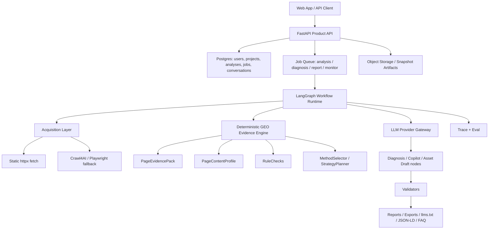

# 商业产品化重构与 Agent 架构方案

状态：proposal  
最后更新：2026-06-25  
外部依据核验日期：2026-06-25

## 1. 结论

这不是“完美方案”。长期可持续产品不应该追求一次性完美架构，而应该追求：

```text
核心领域稳定
+ 外围基础设施可替换
+ 每一阶段都有可验证退出标准
+ 新框架只解决已被证明确认的问题
```

当前项目不建议整体迁移成“LangChain 应用”，也不建议用 Dify / Open WebUI / LibreChat 这类通用平台替换现有主链路。

推荐方案是：

```text
保留现有 PageEvidence / RuleChecks / MethodSelector / SafePromptPack
-> 引入 LangGraph 作为后端多步工作流编排层
-> 引入数据库、任务队列、观测、评测和产品工作台
-> 把当前 demo 收敛成 80% 商业产品
```

核心理由：

- 当前项目最有价值的资产是可追溯页面证据、规则、方法卡和校验器，不是通用聊天。
- 当前问题主要来自产品化基础设施缺失、LLM 编排粗糙、存储仍是文件快照、前端工作流不完整、缺真实样本评测。
- LangChain 本身不能自动解决这些问题；LangGraph 的持久化、有状态工作流、human-in-the-loop 和 tracing 更适合承接当前项目的下一阶段。
- GEO 领域已有开源工具可参考评分维度、报告输出、llms.txt 和监控能力，但多数不能直接替代本项目。

一句话架构：

```text
FastAPI 产品 API
+ LangGraph 工作流运行时
+ Deterministic GEO Evidence Engine
+ Postgres 业务状态
+ Object/Snapshot Storage 调试产物
+ LLM Provider Gateway
+ Evaluation / Trace / Report Workbench
```

二次审计后的优化结论：

- LangGraph 是推荐的工作流运行时，但应在 Postgres / Job / Repository 地基稳定后引入，不应作为第一个重构步骤。
- Pydantic AI 可作为结构化 LLM 调用与 eval 候选，尤其贴合当前 FastAPI + Pydantic 代码风格；但它不应替代 LangGraph 的长流程持久化职责。
- OpenAI Agents SDK 适合 OpenAI-first 产品，可参考 tracing / guardrails / handoff 设计，但当前不作为默认依赖。
- LlamaIndex 适合 Research KB、llms.txt、文档 ingestion 和后期检索，不进入当前在线主链路。
- 当前最优工程路线不是“多 agent”，而是“确定性 pipeline + 少量受控 LLM 节点 + 可恢复 workflow + 可评测输出”。

## 2. 当前项目体检

### 2.1 应保留的资产

当前代码已经有较强的领域基础：

- `apps/api/app/page_evidence/*`：URL safety、fetch、parse、structured data、content blocks、geo signals、profile、rule checks。
- `apps/api/app/methods/*`：方法卡编译、规则映射、方法选择、策略规划。
- `apps/api/app/safe_prompt/*`：安全模型输入包。
- `apps/api/app/diagnosis/*`：诊断输出 schema 和 validator。
- `apps/api/app/conversations/*`：ConversationSafePack、CopilotTurn、validator 和基础历史保存。
- `packages/contracts/schemas/*`：多个核心对象已有 schema 对齐测试。
- `apps/api/tests/*`：已有 fixture 和 contract 回归样本。

这些模块不应被 LangChain agent 重写。它们应成为 LangGraph 节点调用的纯业务能力。

### 2.2 当前主要问题

当前离商业产品差的不是“有没有 agent 框架”，而是这些系统缺口：

| 问题 | 当前表现 | 产品化影响 |
|---|---|---|
| 存储仍是文件快照 | `data/analyses/{id}` 是主存储 | 无用户历史、团队空间、多实例、查询、权限 |
| 请求同步执行 | URL 分析 / 诊断容易长时间阻塞 | 体验不稳定，失败不可恢复 |
| LLM 调用层过薄 | DeepSeek JSON prompt + 手写修补 | 输出质量漂移，缺 tracing / eval / replay |
| 前端像 demo | landing + workbench 混合，报告页不完整 | 难以承载商业用户完整工作流 |
| 无项目 / 站点概念 | 只有单 analysis | 无法做站点级审计、历史对比、监控 |
| 无真实质量评测 | fixture 多，但 provider 质量样本少 | 难证明建议质量、避免刻板模板 |
| 无用户系统 | provider config 进程内覆盖 | API key、账单、团队权限都不可用 |
| 无发布级运维 | 缺队列、日志、trace、rate limit | 商业化风险高 |

## 3. 外部方案判断

### 3.1 LangChain / LangGraph

LangGraph 官方定位是 agent orchestration runtime，强调 durable execution、streaming、human-in-the-loop 和 persistence；LangChain 更偏模型、工具和 agent loop 抽象。官方文档也说明 LangGraph 不会替你抽象 prompts 或架构，而是提供长运行、有状态工作流基础设施。

本项目应采用：

```text
LangGraph：工作流编排、状态机、恢复、流式、人工确认
LangChain：仅在需要统一模型 / tool adapter 时少量使用
LangSmith 或 OpenTelemetry：trace、debug、eval
```

不应采用：

```text
把 PageEvidence / RuleChecks 全塞进一个 LangChain agent 让模型自由决定
```

### 3.2 OpenAI Agents SDK

OpenAI Agents SDK 有 agent definitions、handoffs、guardrails、state、observability 和 tracing。它适合 OpenAI 模型优先的产品，但本项目已经支持 DeepSeek / OpenAI-compatible provider，并且需要强 domain pipeline。因此可作为设计参考，不作为默认迁移目标。

### 3.3 LlamaIndex

LlamaIndex 的 structured output 和 workflow / retrieval 能力适合研究知识库、文档 ingestion、llms.txt 生成和后期方法库检索。当前不建议让 LlamaIndex 替代 MethodSelector v0；后续可用于 Research KB 后台。

### 3.4 Pydantic AI

Pydantic AI 是当前方案需要补充考虑的候选，因为本项目已经以 FastAPI / Pydantic v2 为核心，且当前最大痛点之一是 LLM 输出结构化、测试和评测。

建议定位：

```text
Pydantic AI：LLMProviderGateway 内部的结构化调用 / eval 适配候选
LangGraph：跨步骤工作流状态、恢复、人工确认、流式状态
```

不建议定位：

```text
Pydantic AI 替代 PageEvidence / RuleChecks
Pydantic AI 替代 LangGraph 处理长任务状态
LangGraph + Pydantic AI + LangChain 全部同时深度接入
```

采用条件：

- 现有 `DeepSeekClient` 和手写 repair 继续导致输出可靠性问题。
- 需要代码优先 eval dataset 和类型安全 agent dependencies。
- 能在一个 LLM gateway 内封装，不泄漏到 PageEvidence / methods 等确定性模块。

### 3.5 GEO / SEO 开源项目

外部 GitHub 参考：

- `Auriti-Labs/geo-optimizer-skill`：高信号参考。它公开宣称覆盖 8 个评分类别、47 个方法、1720 个测试，并支持 CLI、Python library、MCP server、Astro integration。可借鉴评分维度、测试密度、报告格式、MCP/CI 形态。
- `zurd46/AISeoAgent`：展示了 LangGraph + parallel agents + HTML report 的 SEO agent 形态，但 star 和成熟度较低，适合参考编排概念，不适合照搬。
- `haroon0x/CrawlWise`：FastAPI + React + PocketFlow + Crawl4AI 的 GEO agent demo，可参考“crawl -> audit node -> enhancement node -> JSON result”的轻量 pipeline，但整体更像样例。
- `answerdotai/llms-txt`：llms.txt 标准思路值得纳入产品产物，尤其适合“生成可发布资产”。
- `rlancemartin/llmstxt_architect`：可参考自动生成 llms.txt 的产品模块。
- `Crawl4AI` / `Firecrawl`：可作为动态抓取和 LLM-ready markdown fallback，不应默认替代本项目现有安全抓取层。

结论：

```text
可借鉴成熟工具的评分维度、报告产物、llms.txt、CI/MCP、站点级监控。
不建议 fork 或直接替换当前项目。
```

## 4. 推荐目标架构



### 4.1 成熟工程化分层

推荐把后端分成五类模块，避免所有逻辑继续挤在 `service.py`：

| 层 | 作用 | 当前代码迁移方向 |
|---|---|---|
| Product API | HTTP contract、auth、pagination、error shape | `routers/*` 变薄，只调用 application use case |
| Application Use Cases | `CreateAnalysisJob`、`GenerateDiagnosis`、`SendCopilotMessage` | 新增 `apps/api/app/application/` |
| Domain Engine | GEO 证据、规则、方法、策略、安全 prompt | 保留并深化 `page_evidence`、`methods`、`safe_prompt` |
| Infrastructure Adapters | DB、queue、object storage、LLM provider、crawler fallback | 新增 repositories / gateway / workers |
| Workflow Runtime | 长任务状态机、恢复、human-in-loop、streaming | 后续新增 `workflows/`，用 LangGraph |

硬规则：

- Domain Engine 不 import FastAPI、数据库 session、LangGraph 或具体 LLM SDK。
- Product API 不直接读写 snapshot 文件。
- Workflow 节点只编排，不重新实现解析、规则、方法选择。
- LLM 输出永远先进入 schema / validator，再进入产品 read model。

### 4.2 数据所有权

商业产品需要数据库成为“状态事实源”，snapshot 退回“可调试 artifact”。

最小聚合：

| 聚合 | 核心字段 | 说明 |
|---|---|---|
| `Workspace` | id、name、owner_id | 团队 / 项目空间，先可单用户 |
| `Project` | id、workspace_id、name、site_url | 站点或客户项目 |
| `Analysis` | id、project_id、source_type、status、snapshot_uri、created_at | 单次页面分析索引 |
| `Job` | id、analysis_id、type、status、attempts、error_code | 后台执行状态 |
| `Artifact` | id、analysis_id、kind、uri、sha256、schema_version | evidence / report / export |
| `ConversationThread` | id、analysis_id、status | 绑定分析，不做全局聊天 |
| `Message` | id、thread_id、role、content、turn_id | 用户和 Copilot 历史 |
| `ProviderConfig` | id、workspace_id、provider、encrypted_secret_ref | 持久 provider 配置 |
| `EvalRun` | id、dataset_version、model、prompt_version、score | LLM 质量门禁 |

第一阶段不需要把 `PageEvidencePack` 完全拆表。建议：

```text
Postgres 保存索引、状态、权限、版本、摘要字段
Object/Snapshot Storage 保存大 JSON artifact 和 raw/clean 调试产物
```

这样既能产品化，又避免过早把复杂 evidence 对象关系化。

### 4.3 作业状态机

所有长任务统一用一套状态，避免每个接口各自处理失败：

```text
queued -> running -> succeeded
queued -> running -> retrying -> running
running -> failed
running -> canceled
```

每个 job 必须记录：

- `idempotency_key`
- `attempt_count`
- `input_hash`
- `artifact_refs`
- `last_error_code`
- `started_at` / `finished_at`
- `trace_id`

验收标准：

- API 重启后 job 状态不丢。
- 同一个 URL + input context 可防重复提交或明确创建新版本。
- 失败可重试，且不会覆盖已成功 artifact。

## 5. LangGraph 节点设计

### 5.1 AnalyzePageGraph

职责：把 URL 或上传页面变成可追溯分析结果。

```text
validate_input
-> acquire_page
-> parse_page
-> build_profile
-> run_rules
-> select_methods
-> plan_strategy
-> build_safe_prompt_pack
-> persist_analysis
```

保留现有确定性模块，只把 `PageEvidenceService._analyze_source()` 拆成可组合节点。

### 5.2 DiagnosisGraph

职责：生成诊断报告和资产草案。

```text
load_safe_pack
-> call_llm_structured
-> validate_diagnosis
-> repair_or_retry_once
-> persist_diagnosis
-> compile_report_view
```

关键变化：

- 把“重试、修补、校验、保存”变成可追踪节点。
- 每次模型输出保留 trace、prompt hash、schema version 和 validator warnings。

### 5.3 CopilotGraph

职责：稳定对话，而不是自由聊天。

```text
load_conversation_state
-> classify_intent
-> build_conversation_safe_pack
-> call_llm_structured
-> unwrap_or_repair_output
-> validate_copilot_turn
-> persist_turn
```

当前对话问题应通过：

- 更强 intent router。
- 每类 intent 独立 prompt。
- 每类输出独立 validator。
- 对相似问题做 answer diversity / anti-repeat policy。

### 5.4 ReportGraph

职责：生成商业用户能消费的报告。

```text
load_analysis_bundle
-> score_summary
-> issue_cards
-> action_plan
-> asset_drafts
-> export_pdf_or_markdown
```

报告不应只是聊天回答。它要成为可保存、可分享、可导出的产品核心。

### 5.5 SiteMonitorGraph（后期）

职责：从单 URL 产品升级到站点 / 项目级产品。

```text
sitemap_discovery
-> batch_page_analysis
-> site_level_aggregation
-> regression_detection
-> scheduled_visibility_prompts
-> alert
```

## 6. 产品架构

### 6.1 产品形态

当前产品不应定位为“AI 聊天助手”，而应定位为：

```text
面向站点页面的 GEO 审计、修复计划和资产生成工作台
```

核心用户流程：

1. 创建 Project / Site。
2. 输入 URL、上传 HTML 或导入 sitemap 小批量 URL。
3. 生成页面级 GEO report。
4. 查看 issue cards、evidence refs、priority actions。
5. 复制或导出资产：metadata、FAQ、JSON-LD、definition block、llms.txt。
6. 用 Copilot 解释报告和生成局部草案。
7. 后续重新分析，比较前后变化。

### 6.2 产品边界

MVP 必须回答：

- 页面为什么不容易被 AI answer engine 选择？
- 哪些内容能被吸收，哪些缺证据？
- 先改哪三件事？
- 可以复制什么草案去改站？
- 改完后如何验证是否变好？

MVP 不承诺：

- 保证排名。
- 保证 ChatGPT / Perplexity 引用。
- 自动修改客户线上站点。
- 大规模全网监控。

### 6.3 商业完成度定义

80% 商业产品不是功能数量达到 80%，而是核心闭环可信：

| 维度 | 80% 标准 |
|---|---|
| 输入 | URL / HTML upload / sitemap 小批量可用 |
| 证据 | 每个问题可回到 evidence_ref |
| 建议 | 每个行动有 method_ref 和可执行资产 |
| 状态 | 分析历史、任务状态、失败重试可见 |
| 质量 | golden eval 阻止 prompt / model 回归 |
| 体验 | 报告页可读，Copilot 只是辅助 |
| 运维 | provider、trace、error、成本可观察 |

## 7. 长期可持续迭代原则

### 7.1 架构不变量

这些不变量后续不应轻易破坏：

- Raw HTML 永远不是模型直接输入。
- 页面事实必须先进入 `PageEvidencePack` / `PageContentProfile`。
- 修复建议必须绑定 `method_ref`。
- 用户提供的业务目标不能冒充页面已验证事实。
- LLM 输出进入产品前必须通过 schema 和业务 validator。
- 公开 API 只暴露稳定 read model，内部 artifact 可版本化演进。

### 7.2 可替换点

这些可以替换：

- 静态抓取可新增 Crawl4AI / Playwright / Firecrawl fallback。
- DeepSeek 可替换为 OpenAI-compatible / Anthropic adapter。
- 文件 snapshot 可迁移到 S3 / R2。
- 本地 worker 可迁移到 Celery / cloud queue。
- LangSmith 可替换为 OpenTelemetry + self-hosted trace。

### 7.3 禁止过早引入

除非触发条件成立，不做：

- 微服务拆分。
- pgvector 替代 MethodSelector。
- 多 agent 互相辩论式诊断。
- 浏览器自动修改客户网站。
- 全量 RAG 平台。
- 完整账号计费系统。

触发条件必须写进 issue，而不是靠感觉。

## 8. 80% 商业产品范围

### 8.1 必须有

| 模块 | 目标 |
|---|---|
| Project / Site Workspace | 用户以站点或项目管理分析 |
| URL + Upload + Crawl Intake | 单 URL、HTML 上传、sitemap 小批量 |
| Analysis Job System | 后台任务、状态、失败重试 |
| Report UI | 总分、问题、证据、优先级、资产草案 |
| Copilot Chat | 绑定 analysis/project，能解释和生成草案 |
| Asset Drafts | title/description、FAQ、definition block、JSON-LD、llms.txt |
| Provider Settings | 支持 DeepSeek、OpenAI-compatible，持久加密保存 |
| Evaluation Harness | golden samples、provider regression、prompt trace |
| Observability | request log、LLM trace、validator failure dashboard |
| Export | Markdown / JSON / PDF 基础导出 |

### 8.2 可以暂缓

- 全站大规模爬虫。
- 真正的 AI search visibility 排名监控。
- 多人协作评论。
- 支付计费。
- 浏览器自动修站。
- 完整 RAG 研究后台。

## 9. 技术选型

推荐：

| 层 | 推荐 |
|---|---|
| API | 保留 FastAPI + Pydantic v2 |
| Workflow | LangGraph；仅在 Phase B 引入 |
| DB | Postgres + SQLAlchemy / SQLModel |
| Queue | 初期 `arq` / `dramatiq` / `rq` 任一轻量队列，后期 Celery |
| Artifact Storage | 本地文件先兼容，抽象成 ObjectStorage，后期 S3/R2 |
| Crawl fallback | 先 Playwright 或 Crawl4AI，本地可控；Firecrawl 作为 hosted fallback |
| LLM | 抽 `LLMProviderGateway`；内部可评估 Pydantic AI，外部保持 provider-neutral |
| Observability | OpenTelemetry + LangSmith 可选 |
| Frontend | 保留 Next.js，重做成 Workbench + Report，不再 landing 优先 |
| Chat UI | assistant-ui primitives 可选，业务 runtime 自控 |

不推荐：

- 全量迁移到 Dify / RAGFlow。
- 让 LangChain agent 直接抓 URL、读 raw HTML、决定规则。
- 一上来引入 pgvector 替代现有 MethodSelector。
- 把文件 snapshot 直接删掉；它仍是调试和回归资产。

### 9.1 技术选择门禁

| 候选 | 采用条件 | 拒绝条件 |
|---|---|---|
| LangGraph | 需要持久化多步状态、恢复、流式进度、人审节点 | 只是单次同步函数调用 |
| Pydantic AI | LLM structured output / eval 成本继续升高 | 引入后会与 LangGraph /现有 Pydantic model 双重建模 |
| LlamaIndex | Research KB / llms.txt / 文档 ingestion | 在线 PageEvidence 主链路 |
| Crawl4AI / Playwright | 静态抓取在真实样本中系统性失败 | 只是为了“看起来更 AI” |
| pgvector | 方法卡超过 100 且 deterministic selector 召回不足 | 当前 12 张 seed method |

## 10. 迁移路线

### Phase A：止血和产品化地基

目标：当前 demo 先稳定。

1. 加 Postgres schema：users、projects、analyses、jobs、conversation_threads、messages、provider_configs。
2. 保留 snapshot，但数据库成为索引和状态源。
3. 后台任务化 URL 分析和 diagnosis。
4. 前端拆成 Workbench / Report / Settings 三个稳定页面。
5. 给现有 provider 输出加 trace 和 golden eval。

验收：

- 用户能看到历史分析。
- 失败任务可重试。
- 后端重启后 provider config 和 conversation 不丢。
- 至少 20 个真实页面 golden 样本。
- 所有新增 API 有契约测试。
- 现有 `POST /api/analyses` 行为保持兼容。

### Phase B：LangGraph 编排迁移

目标：把流程从 service 内大函数迁到 graph，但不改核心算法。

1. 新增 `apps/api/app/workflows/`。
2. 实现 `AnalyzePageGraph`，节点内部调用现有函数。
3. 实现 `DiagnosisGraph` 和 `CopilotGraph`。
4. 加 checkpointer / DB persistence。
5. 每个 graph run 记录 state、trace、artifact refs。

验收：

- 现有 API contract 不破。
- 原有 tests 通过。
- graph run 可恢复、可追踪。
- conversation 不再出现 JSON 直出和模板复读。
- graph 节点的输入输出都有 Pydantic schema。

### Phase C：商业报告和资产产物

目标：用户看到的是“能执行的报告”，不是模型聊天。

1. 新增 report read model。
2. issue cards + action cards + asset drafts。
3. 生成 FAQ / JSON-LD / llms.txt / metadata patch。
4. Markdown / JSON / PDF 导出。
5. 前端支持 evidence ref 点击定位。

验收：

- 一个真实 URL 可生成完整报告。
- 每条建议都有 evidence_ref / method_ref。
- 用户可复制资产草案。
- 移动端可用。
- 报告 read model 不要求前端拼接 methods / strategy / diagnosis。

### Phase D：站点级和监控

目标：从单页面工具升级成项目产品。

1. sitemap / URL list 批量分析。
2. site-level aggregation。
3. 定期重新分析。
4. 历史趋势和回归提醒。

### Phase E：规模化与团队化

触发条件：

- 有真实用户项目需要多人协作。
- 批量分析超过单机 worker 舒适区。
- 需要账单、权限、团队空间或审计日志。

开发项：

- workspace roles。
- usage metering。
- rate limits。
- audit logs。
- multi-worker deployment。

## 11. 第一批可执行 issue

1. 设计并实现 Postgres 最小 schema，不迁移核心 evidence JSON。
2. 抽象 `AnalysisRepository`，让读取先查 DB 索引，再读 snapshot artifact。
3. 新增 `JobService` 和后台 worker，支持 analysis job 状态。
4. 把 `PageEvidenceService._analyze_source()` 拆成 workflow-friendly steps。
5. 新增 `LLMProviderGateway`，替换 `DeepSeekClient` 直接暴露给业务 service 的方式。
6. 为 Copilot 增加 intent-specific prompt builders。
7. 新增 provider output regression dataset，覆盖至少 20 个真实页面和 5 类追问。
8. 前端新增 `/app/projects`、`/app/analyses/{id}`、`/app/settings/provider`。
9. 新增 report read model API，不再让前端拼散落的 methods / strategy / diagnosis。
10. 增加 `llms.txt` / FAQ / JSON-LD 三类 asset export。

第一批 issue 的顺序必须是：

```text
DB / repository / job state
-> LLM gateway + eval trace
-> report read model
-> workflow extraction
-> LangGraph runtime
```

原因：没有持久状态和 eval，先上 LangGraph 只会把 demo 问题换一种形态保存下来。

## 12. 反方案与取舍

### 12.1 全量 LangChain Agent 重写

拒绝。

原因：

- 会丢掉当前确定性 evidence / rules / method refs。
- LLM 会被迫承担事实抽取、规则判断和建议生成三重职责。
- 当前已出现模型格式不稳问题，全量 agent 会放大该风险。

### 12.2 直接接入 Dify / RAGFlow

拒绝作为主链路。

原因：

- 本项目核心不是通用 RAG，而是页面级 GEO evidence 和可追溯报告。
- 平台会强化 prompt/workflow 外壳，但弱化本项目最重要的领域模型。

可作为：

- 内部研究 KB。
- 非核心运营后台。

### 12.3 直接做全站爬虫

暂缓。

原因：

- 单页面分析质量尚未达到商业级。
- 批量会放大抓取失败、页面类型误判和报告噪声。

触发条件：

- 单页 report 稳定。
- sitemap 小批量已验证。
- 有项目级聚合 read model。

## 13. 工程质量门禁

每个阶段必须满足：

| 类别 | 门禁 |
|---|---|
| Contract | 公开 API schema 测试通过 |
| Domain | PageEvidence / RuleChecks fixture 不回归 |
| LLM | golden eval 通过，validator failure rate 可见 |
| Storage | migration 可回滚，关键表有索引和约束 |
| Jobs | 幂等、重试、失败状态可观察 |
| Frontend | typecheck/build，核心移动端不溢出 |
| Security | provider secret 不明文回显，raw HTML 不进模型 |
| Cost | 每次 analysis / diagnosis 记录 token 和延迟 |

## 14. 决策

默认路线：

```text
LangGraph 增量引入 + 保留确定性 GEO 引擎 + 补齐商业产品地基。
```

不要做：

```text
全量重写成 LangChain Agent。
```

这会丢掉当前最有价值的可追溯证据和规则资产，而且会把已经出现的 DeepSeek 输出不稳定问题放大。

真正能把项目推进到 80% 商业完成度的，是：

- 稳定工作流。
- 稳定状态和历史。
- 可追踪模型调用。
- 可评测输出质量。
- 可执行报告和资产。
- 站点 / 项目级产品体验。

## 15. 外部参考

- LangGraph overview: https://docs.langchain.com/oss/python/langgraph/overview
- LangGraph persistence: https://docs.langchain.com/oss/python/langgraph/persistence
- Pydantic AI overview: https://pydantic.dev/docs/ai/overview/
- Pydantic AI agents / evals: https://pydantic.dev/docs/ai/core-concepts/agent/
- OpenAI Agents SDK guide: https://developers.openai.com/api/docs/guides/agents
- OpenAI Agents SDK tracing: https://openai.github.io/openai-agents-python/tracing/
- GEO Optimizer Skill: https://github.com/Auriti-Labs/geo-optimizer-skill
- AISeoAgent: https://github.com/zurd46/AISeoAgent
- CrawlWise: https://github.com/haroon0x/CrawlWise
- llms.txt: https://github.com/answerdotai/llms-txt
- llmstxt_architect: https://github.com/rlancemartin/llmstxt_architect
- Crawl4AI: https://docs.crawl4ai.com/
- Firecrawl: https://www.firecrawl.dev/
