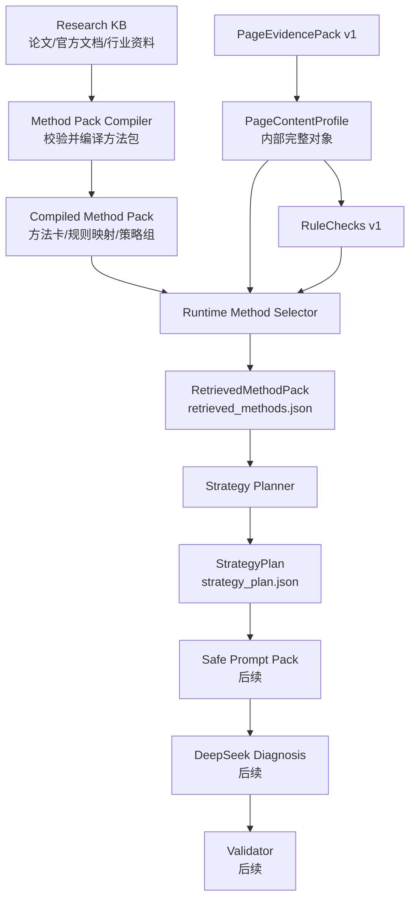

# 知识库架构技术开发方案

状态：implemented-v0
最后更新：2026-06-22

## 1. 方案结论

本项目的知识库不应设计成运行时通用 RAG 系统。当前最优架构是：

```text
Research KB
-> Method Pack Compiler
-> Runtime Method Selector
-> Strategy Planner
-> DeepSeek Diagnosis（后续）
-> Validator（后续）
```

核心判断：

- `Research KB` 只负责沉淀论文、官方文档、行业资料和方法来源。
- 产品主链路的核心是可编译、可测试、可版本化的 `MethodPack`。
- `MethodSelector v0` 必须先基于已冻结的 `PageContentProfile`、`RuleChecks`、`failure_type` 和 `evidence_refs` 做确定性选择。
- `DeepSeek` 只能后置消费结构化事实、已选方法和安全短 excerpt，不能直接读取 URL、raw HTML 或完整 clean markdown。
- `RAGFlow`、`Dify`、`LlamaIndex`、`Qdrant` 只能作为后期研究后台或增强层，不能成为当前主链路前置依赖。

## 2. 输入依据

本方案综合以下输入、状态源、正式文档口径和当前代码状态：

- `docs/DEVELOPMENT_STATUS.md`
- `docs/README.md`
- `docs/开发过程中定义文件/独立最优方案分析.md`
- `docs/开发过程中定义文件/deep-research-report.md`
- `docs/GEO项目总纲.md`
- `docs/GEO实施路线与架构决策.md`
- `docs/GEO架构技术栈与工具整合建议.md`
- `docs/GEO论文优化方法知识库.md`
- `docs/模块开发补充/HTTP层GEO开发流程与完成标准.md`
- 当前代码中的 `apps/api/app/page_evidence/*`
- 当前 contract 中的 `packages/contracts/schemas/retrieved-method-pack.schema.json`

冲突裁决仍以 `docs/DEVELOPMENT_STATUS.md` 为准。本文件只提供知识库与 MethodSelector 后续开发方案，不替代当前开发状态源。

## 3. 当前仓库事实

截至本方案编写时，已验证事实如下：

- HTTP / Page Evidence v1 已完成最终冻结验收。
- 主链路已完成 `PageEvidencePack v1 + extraction + geo_signals + RuleChecks v1 P0 + snapshot + API base report + minimal public PageContentProfile subset`。
- 当前公开 API 已冻结为 `page_evidence + page_content_profile(minimal public subset) + rule_checks + snapshot_dir`。
- 完整 `PageContentProfile` 继续保留在 service 内部结果、snapshot 和 `analysis.json` 中，不作为公开 API 全量字段返回。
- `RuleChecks v1 P0` 已覆盖 selection、absorption、claim-evidence、structure、schema、safety 六类基础规则，并输出 `failure_type`。
- `apps/api/app/methods/` 已实现 Method Pack Compiler、Runtime Method Selector 和 Strategy Planner v0。
- `apps/api/app/safe_prompt/` 已实现 Safe Prompt Pack v0 的构建与输入侧 validator。
- `apps/api/app/diagnosis/` 已实现 DeepSeek diagnosis 输出 schema / validator。
- `apps/api/app/rag/` 当前为空目录，不应被误认为当前 MethodSelector 主实现。
- 下一阶段如继续推进，应显式进入 DeepSeek Diagnosis 模型调用边界；当前仍不做 RAG / hybrid retrieval。
- 当前明确不优先 DeepSeek、完整前端报告 UI、pgvector / hybrid retrieval。

## 4. 非目标

当前方案不做以下事项：

- 不把 `RAGFlow`、`Dify`、`FastGPT`、`AnythingLLM` 接入正式 API 主链路。
- 不在 `MethodSelector v0` 前引入 Qdrant、pgvector、LlamaIndex 或 hybrid retrieval。
- 不让 DeepSeek 决定方法论、事实抽取或规则结果。
- 不修改已冻结的 `POST /api/analyses` / `GET /api/analyses/{analysis_id}` 公开响应字段。
- 不把完整 `PageContentProfile` 对外公开。
- 不把方法卡散落在多个 Markdown、prompt 或代码常量中。
- 不把论文全文、研究报告全文或整库内容直接塞进模型 prompt。
- 不在没有测试保护的情况下新增规则、方法映射或策略排序。

## 5. 总体架构



### 5.1 Research KB

职责：

- 存放 GEO 论文、官方规范、研究报告、方法来源和人工整理笔记。
- 为方法卡提供来源依据、证据等级、适用边界和反模式。
- 支持人工研究、内部问答、方法发现和后续 method card 维护。

推荐落点：

- 当前正式来源：`docs/GEO论文优化方法知识库.md`
- 当前讨论来源：`docs/开发过程中定义文件/deep-research-report.md`
- 可选外部后台：RAGFlow 或 Dify，仅用于研究资料管理和人工问答

禁止事项：

- 不在用户每次 URL 分析时调用 Research KB。
- 不让 Research KB 的召回结果直接进入正式诊断输出。
- 不让外部 RAG 平台决定 `method_ref`、`failure_type` 或策略顺序。

### 5.2 Method Pack Compiler

职责：

- 把人工维护的种子方法、规则映射、策略组编译成可运行的 `CompiledMethodPack`。
- 对 `method_ref`、`rule_id`、`failure_type`、`strategy_group`、`expected_artifacts`、`guardrails` 做强校验。
- 生成稳定版本号、内容 hash 和编译报告。
- 在缺少 P0 rule 覆盖、引用不存在方法、page type 冲突或方法卡缺安全边界时 fail closed。

为什么它比直接 RAG 更重要：

- 当前方法规模可人工维护，确定性编译能获得更高可测性。
- `RuleChecks` 已经有明确 `rule_id` 和 `failure_type`，不需要语义召回从零判断。
- 后续 DeepSeek 需要的是少量高相关方法，而不是整库文本。

### 5.3 Runtime Method Selector

职责：

- 输入完整内部 `PageContentProfile`、`RuleChecks` 和编译后的 `MethodPack`。
- 只对 `failed` / `warning` 的规则选择方法。
- 优先 exact `rule_id` 映射，其次 `failure_type` 映射，再用 `page_type`、readiness、content gaps 和 severity 排序。
- 输出可追溯的 `RetrievedMethodPack`，每个 chunk 必须说明 `why_selected`。

选择器不是：

- 不是 LLM。
- 不是 RAG 问答。
- 不是全文语义搜索。
- 不是直接生成诊断报告。

### 5.4 Strategy Planner

职责：

- 把已选方法组织成有先后顺序的修复策略。
- 合并重复方法和相近行动。
- 标注每一步所需 evidence、method、expected artifact 和后续 validator 要求。
- 为后续 DeepSeek 提供稳定、安全、低噪声的计划输入。

策略顺序默认采用：

```text
critical_safety
-> selection_foundation
-> structure_readability
-> absorption_foundation
-> claim_evidence_strengthening
-> schema_alignment
```

说明：

- `critical_safety` 永远最高优先级。
- `structure_readability` 放在 absorption 之前，因为结构问题会影响后续抽取和复用。
- `schema_alignment` 默认在可见内容修复之后执行，避免为不存在或不可信的可见内容补 markup。
- 若 `schema.visible_alignment_poor` 为 high severity，可与相关内容修复步骤绑定提前处理。

### 5.5 DeepSeek Diagnosis

后续阶段才接入。接入前必须已有：

- `PageEvidencePack`
- 完整内部 `PageContentProfile`
- `RuleChecks`
- `RetrievedMethodPack`
- `StrategyPlan`
- `evidence_refs`
- `method_refs`
- `guardrails`
- `expected_artifacts`

DeepSeek 的职责是把已选方法和证据组织为结构化诊断、优先行动和资产草案。它不是事实来源，也不是方法选择器。

### 5.6 Validator

后续阶段必须校验：

- 每条 issue 必须有 `evidence_ref[]` 和 `method_ref[]`。
- 每条 action 必须有 `evidence_ref[]` 和 `method_ref[]`。
- 每个 asset draft 必须声明来源、未知项和不可编造边界。
- 输出不能引用 raw HTML 指令、隐藏内容指令或未进入 profile 的自由文本。
- unsupported claim 必须保持 `unknown` 或要求补证据，不能被模型改写成确定事实。

## 6. 核心数据对象

### 6.1 MethodChunk

`MethodChunk` 是一张可执行方法卡，不是论文摘要。

建议字段：

| 字段 | 类型 | 要求 |
|---|---|---|
| `method_ref` | string | 全局唯一，稳定不复用 |
| `title` | string | 给人读的短标题 |
| `priority` | enum | `P0` / `P1` / `P2` |
| `strategy_group` | string | 必须存在于 `StrategyGroup` |
| `applies_to_page_types` | array | 必须属于当前 `PageContentProfile.page_type` 枚举 |
| `applies_to_rule_ids` | array | 可为空，但推荐由 binding 维护 |
| `applies_to_failure_types` | array | 可为空，但推荐覆盖当前 P0 failure types |
| `uses_profile_fields` | array | 声明会读取哪些 profile 字段 |
| `text` | string | 方法说明，不允许包含模型自由指令 |
| `action_steps` | array | 可落地步骤 |
| `expected_artifacts` | array | 期望产物，如 `definition_block`、`json_ld_patch` |
| `guardrails` | array | 防编造、防越界、防黑帽约束 |
| `evidence_source_refs` | array | 指向 `docs/GEO论文优化方法知识库.md` 中的方法来源或论文来源 id |
| `version` | string | 方法卡版本 |

示例：

```json
{
  "method_ref": "chunk_geo_definition_unit_001",
  "title": "Definition Unit Construction",
  "priority": "P0",
  "strategy_group": "absorption_foundation",
  "applies_to_page_types": ["article", "product", "docs", "landing", "comparison"],
  "applies_to_rule_ids": ["content.definition_unit_missing", "absorption.readiness_low"],
  "applies_to_failure_types": ["absorption_blocker"],
  "uses_profile_fields": [
    "page_type",
    "primary_entity_candidates",
    "answer_units",
    "absorption_readiness"
  ],
  "text": "Add a concise visible definition or summary unit near the top of the page so answer engines can identify and reuse the primary entity.",
  "action_steps": [
    "Identify the primary entity from PageContentProfile.",
    "Check whether a definition-like answer unit already exists.",
    "Create a visible definition block near the top of main content.",
    "Use only facts already present in PageEvidencePack.",
    "Bind the recommendation to evidence_refs."
  ],
  "expected_artifacts": ["definition_block", "top_summary_block"],
  "guardrails": [
    "Do not invent product capabilities.",
    "Do not create unsupported factual claims.",
    "If primary entity is unclear, pair with primary entity clarification first."
  ],
  "evidence_source_refs": [
    "paper_selection_absorption_2026",
    "paper_geo_sfe_2026"
  ],
  "version": "1.0.0"
}
```

### 6.2 RuleMethodBinding

`RuleMethodBinding` 把规则命中显式绑定到方法，避免 selector 依赖模糊文本。

建议字段：

| 字段 | 类型 | 要求 |
|---|---|---|
| `rule_id` | string | 当前 `RuleCheck.rule_id` |
| `failure_type` | string | 当前 `RuleCheck.failure_type` |
| `default_methods` | array | 必须引用存在的 `method_ref` |
| `fallback_methods` | array | 可选 |
| `required_strategy_group` | string | 可选，但推荐 |
| `severity_override` | object | 可按 failed/warning 调整 P0/P1 |
| `notes` | string | 人工维护说明 |

示例：

```json
{
  "rule_id": "content.definition_unit_missing",
  "failure_type": "absorption_blocker",
  "default_methods": [
    "chunk_geo_definition_unit_001",
    "chunk_geo_primary_entity_001"
  ],
  "required_strategy_group": "absorption_foundation",
  "severity_override": {
    "failed": "P0",
    "warning": "P1"
  }
}
```

### 6.3 StrategyGroup

`StrategyGroup` 定义方法执行顺序和依赖。

建议初始组：

| strategy_group | rank | 说明 |
|---|---:|---|
| `critical_safety` | 10 | prompt injection、安全边界、禁止不可信输入 |
| `selection_foundation` | 20 | title、description、canonical、lang、primary entity |
| `structure_readability` | 30 | H1、heading hierarchy、outline、main structure |
| `absorption_foundation` | 40 | definition、summary、answer units、substance |
| `claim_evidence_strengthening` | 50 | claim/evidence、numeric source、statistics |
| `schema_alignment` | 60 | structured data presence、visible alignment、Article/Product schema |

### 6.4 RetrievedMethodPack

当前仓库已有 `packages/contracts/schemas/retrieved-method-pack.schema.json`，其最小要求是：

```json
{
  "retrieval_query": {},
  "chunks": [
    {
      "method_ref": "...",
      "title": "...",
      "text": "...",
      "why_selected": "..."
    }
  ]
}
```

后续应在不破坏上述 required 字段的前提下扩展：

- `pack_version`
- `compiled_method_pack_version`
- `analysis_id`
- `selection_mode`: 固定为 `deterministic_v0`
- `retrieval_query.page_type`
- `retrieval_query.failed_rule_ids`
- `retrieval_query.warning_rule_ids`
- `retrieval_query.failure_types`
- `chunks[].matched_rule_ids`
- `chunks[].matched_failure_types`
- `chunks[].matched_evidence_refs`
- `chunks[].strategy_group`
- `chunks[].expected_artifacts`
- `chunks[].guardrails`
- `chunks[].score`

### 6.5 StrategyPlan

`StrategyPlan` 是 planner 输出，建议后续新增独立 schema。

建议结构：

```json
{
  "plan_version": "v0",
  "analysis_id": "uuid",
  "strategy_steps": [
    {
      "step_id": "strategy_step_001",
      "strategy_group": "selection_foundation",
      "rank": 20,
      "method_refs": ["chunk_geo_metadata_selection_001"],
      "rule_ids": ["metadata.title_missing"],
      "failure_types": ["selection_blocker"],
      "evidence_refs": ["metadata.title"],
      "why_now": "Title is missing and selection readiness is weak.",
      "expected_artifacts": ["metadata_patch"],
      "validator_requirements": [
        "Every generated recommendation must include evidence_refs.",
        "No unsupported visibility or ranking claims."
      ]
    }
  ]
}
```

## 7. 推荐文件布局

第一阶段新增最小模块：

```text
apps/api/app/methods/
  __init__.py
  models.py
  registry.py
  compiler.py
  selector.py
  planner.py
  data/
    geo_methods.seed.json
    rule_method_bindings.seed.json
    strategy_groups.seed.json
```

推荐 contract：

```text
packages/contracts/schemas/
  retrieved-method-pack.schema.json       # 已存在，扩展而不是另起一份运行时输出 schema
  method-pack.schema.json                 # 新增，约束 seed/compiled method pack
  strategy-plan.schema.json               # 后续 planner 输出 schema
```

推荐测试：

```text
apps/api/tests/
  test_method_registry.py
  test_method_compiler.py
  test_method_selector.py
  test_method_planner.py
  test_retrieved_method_pack_schema.py
```

说明：

- 正式方法 seed 文件使用 `geo_methods.seed.json`，与已有正式文档口径保持一致。
- `rule_method_bindings.seed.json` 独立维护，避免每次规则映射变化都修改方法正文。
- `strategy_groups.seed.json` 独立维护，避免排序逻辑散落在 selector 或 planner 中。
- 不使用 `apps/api/app/rag/` 实现 `MethodSelector v0`。

## 8. 第一批 MethodChunk

第一阶段先做 12 张 P0/P1 方法卡，覆盖当前 18 条 RuleChecks：

| method_ref | strategy_group | 主要覆盖 |
|---|---|---|
| `chunk_geo_prompt_injection_guard_001` | `critical_safety` | `safety.prompt_injection_suspected` |
| `chunk_geo_metadata_selection_001` | `selection_foundation` | title、description、canonical、lang、selection readiness |
| `chunk_geo_primary_entity_001` | `selection_foundation` | primary entity unclear、selection readiness weak |
| `chunk_geo_h1_structure_001` | `structure_readability` | `structure.h1_missing_or_multiple` |
| `chunk_geo_heading_hierarchy_001` | `structure_readability` | `structure.heading_hierarchy_invalid` |
| `chunk_geo_definition_unit_001` | `absorption_foundation` | `content.definition_unit_missing`、absorption readiness |
| `chunk_geo_main_content_confidence_001` | `absorption_foundation` | `content.minimum_substance_low`、`content.main_content_confidence_low` |
| `chunk_geo_claim_evidence_pair_001` | `claim_evidence_strengthening` | `content.claim_without_evidence` |
| `chunk_geo_numeric_source_001` | `claim_evidence_strengthening` | `content.numeric_claim_without_source` |
| `chunk_geo_schema_alignment_001` | `schema_alignment` | `schema.structured_data_missing`、`schema.visible_alignment_poor` |
| `chunk_geo_product_schema_001` | `schema_alignment` | `schema.product_incomplete` |
| `chunk_geo_article_schema_001` | `schema_alignment` | `schema.article_incomplete` |

## 9. 当前 RuleChecks 映射矩阵

当前 `RuleChecks v1 P0` 规则应至少有以下映射：

| rule_id | failure_type | default_methods |
|---|---|---|
| `metadata.title_missing` | `selection_blocker` | `chunk_geo_metadata_selection_001`, `chunk_geo_primary_entity_001` |
| `metadata.description_missing` | `selection_blocker` | `chunk_geo_metadata_selection_001` |
| `metadata.canonical_missing` | `selection_blocker` | `chunk_geo_metadata_selection_001` |
| `metadata.lang_missing` | `selection_blocker` | `chunk_geo_metadata_selection_001` |
| `selection.readiness_low` | `selection_blocker` | `chunk_geo_metadata_selection_001`, `chunk_geo_primary_entity_001`, `chunk_geo_schema_alignment_001` |
| `structure.h1_missing_or_multiple` | `structure_blocker` | `chunk_geo_h1_structure_001`, `chunk_geo_primary_entity_001` |
| `structure.heading_hierarchy_invalid` | `structure_blocker` | `chunk_geo_heading_hierarchy_001` |
| `content.minimum_substance_low` | `absorption_blocker` | `chunk_geo_main_content_confidence_001`, `chunk_geo_definition_unit_001` |
| `content.main_content_confidence_low` | `absorption_blocker` | `chunk_geo_main_content_confidence_001` |
| `content.definition_unit_missing` | `absorption_blocker` | `chunk_geo_definition_unit_001`, `chunk_geo_primary_entity_001` |
| `absorption.readiness_low` | `absorption_blocker` | `chunk_geo_definition_unit_001`, `chunk_geo_main_content_confidence_001`, `chunk_geo_claim_evidence_pair_001` |
| `content.claim_without_evidence` | `claim_evidence_blocker` | `chunk_geo_claim_evidence_pair_001` |
| `content.numeric_claim_without_source` | `claim_evidence_blocker` | `chunk_geo_numeric_source_001`, `chunk_geo_claim_evidence_pair_001` |
| `schema.structured_data_missing` | `selection_blocker` | `chunk_geo_schema_alignment_001` |
| `schema.visible_alignment_poor` | `schema_blocker` | `chunk_geo_schema_alignment_001` |
| `schema.product_incomplete` | `schema_blocker` | `chunk_geo_product_schema_001`, `chunk_geo_schema_alignment_001` |
| `schema.article_incomplete` | `schema_blocker` | `chunk_geo_article_schema_001`, `chunk_geo_schema_alignment_001` |
| `safety.prompt_injection_suspected` | `safety_blocker` | `chunk_geo_prompt_injection_guard_001` |

Compiler 验收要求：

- 上表所有 rule 必须能命中至少一个现存 method。
- 如果后续新增 P0 rule，compiler 必须在没有 binding 时失败。
- 如果 method 只由 fallback 命中，compiler 应给 warning，人工确认后再允许发布。

## 10. Runtime Selector v0 算法

输入：

- 完整内部 `PageContentProfile`
- `RuleCheck[]`
- 编译后的 `MethodPack`

输出：

- `RetrievedMethodPack`

选择流程：

```text
1. 过滤出 status in {"failed", "warning"} 的 RuleCheck。
2. 按 rule_id exact match 查 RuleMethodBinding。
3. 对没有 exact binding 的规则，用 failure_type fallback 查方法。
4. 根据 PageContentProfile.page_type 过滤不适用方法。
5. 根据 selection_readiness / absorption_readiness / content_gaps 增加解释和分数。
6. 按 safety、severity、status、exact match、strategy_group rank 排序。
7. 合并重复 method_ref，累积 matched_rule_ids、failure_types、evidence_refs。
8. 限制 top-k，默认保留所有 safety 和 high severity 命中，再保留每个 strategy_group 的最高分方法。
9. 输出 chunks，并为每个 chunk 生成确定性 why_selected。
```

建议评分：

| 信号 | 加分 |
|---|---:|
| failed rule exact match | +100 |
| warning rule exact match | +60 |
| failure_type fallback | +40 |
| high severity | +30 |
| medium severity | +15 |
| safety blocker | +1000 |
| page_type exact applicable | +20 |
| readiness weak related | +25 |
| readiness mixed related | +10 |
| content_gap related | +15 |

确定性 `why_selected` 示例：

```text
Selected because content.definition_unit_missing failed with failure_type=absorption_blocker, page_type=product, and absorption_readiness is weak. Evidence refs: geo_signals.page_type_hint, content_blocks[0].
```

## 11. Strategy Planner v0 算法

输入：

- `RetrievedMethodPack`
- `RuleChecks`
- `PageContentProfile`

输出：

- `StrategyPlan`

流程：

```text
1. 按 strategy_group 归组 selected methods。
2. 使用 StrategyGroup.rank 排序。
3. safety group 强制置顶。
4. 对同一 rule_id 或同一 evidence_ref 的方法合并说明。
5. 对 claim/evidence 类方法保留每条 claim 的 evidence_ref。
6. 为每个 step 汇总 expected_artifacts 和 validator_requirements。
7. 输出人类可读但机器可校验的 strategy_steps。
```

Planner 不生成页面文案，只生成行动顺序和约束。

## 12. Service 接入方式

当前正确接入点在 `PageEvidenceService.analyze()` 内部，在已构建 `profile` 和 `rule_checks` 之后：

```python
profile = build_page_content_profile(pack)
rule_checks = build_rule_checks(pack, profile)
method_pack = select_methods(profile, rule_checks)
strategy_plan = plan_strategy(method_pack, profile, rule_checks)
```

第一阶段接入原则：

- 不修改当前公开 `AnalysisResponse`。
- 不把完整 `PageContentProfile` 对外暴露。
- 不要求数据库落库。
- 只在 snapshot 中新增：

```text
retrieved_methods.json
strategy_plan.json
```

后续可新增只读接口：

```text
GET /api/analyses/{analysis_id}/methods
GET /api/analyses/{analysis_id}/strategy
```

这些接口必须读取 snapshot 或内部结果，不反向改变已冻结的 base analysis response。

注意：

- 当前 `AnalysisCreateRequest.business_type` 和 `target_keywords` 已在 request schema 中存在，但当前 service 未使用它们。`MethodSelector v0` 不应偷偷依赖这些字段；如需使用，必须显式改造 request context 传递路径并补测试。
- `apps/api/app/rag/` 不作为 v0 入口。

## 13. Snapshot 设计

当前 snapshot 已包含：

```text
raw.html
clean.md
evidence.json
page_content_profile.json
rule_checks.json
analysis.json
```

MethodSelector 阶段新增：

```text
retrieved_methods.json
strategy_plan.json
```

安全边界：

- `raw.html` 继续只作为证据快照，不进入 DeepSeek prompt。
- `clean.md` 继续只作为抽取产物，不整份进入 DeepSeek prompt。
- `retrieved_methods.json` 必须只包含可信方法库内容和规则选择解释。
- `strategy_plan.json` 必须只包含策略约束，不生成未验证事实。

## 14. Contract 演进

### 14.1 `retrieved-method-pack.schema.json`

现有 schema 应保留：

- `retrieval_query`
- `chunks`
- `chunks[].method_ref`
- `chunks[].title`
- `chunks[].text`
- `chunks[].why_selected`

新增字段采用向后兼容方式。除非同步更新 tests，不删除或重命名现有字段。

### 14.2 `method-pack.schema.json`

建议新增，用于约束：

- `MethodChunk`
- `RuleMethodBinding`
- `StrategyGroup`
- `compiled_at`
- `pack_version`
- `source_hash`
- `compiler_warnings`

### 14.3 `strategy-plan.schema.json`

建议在 planner 阶段新增，用于约束：

- `strategy_steps`
- `method_refs`
- `rule_ids`
- `failure_types`
- `evidence_refs`
- `expected_artifacts`
- `validator_requirements`

## 15. 开发阶段

### Phase 1：Method Pack Seed + Compiler

目标：

- 方法卡可维护、可校验、可版本化。

开发项：

- 新增 `apps/api/app/methods/models.py`
- 新增 `apps/api/app/methods/compiler.py`
- 新增 `apps/api/app/methods/data/geo_methods.seed.json`
- 新增 `apps/api/app/methods/data/rule_method_bindings.seed.json`
- 新增 `apps/api/app/methods/data/strategy_groups.seed.json`
- 新增 `packages/contracts/schemas/method-pack.schema.json`

验收：

- `method_ref` 唯一。
- 每个当前 P0 `rule_id` 至少有一个 method 覆盖。
- 每个 method 都有 `guardrails` 和 `expected_artifacts`。
- 每个 method 的 `strategy_group` 存在。
- 每个 method 的 page type 都属于当前 enum。
- binding 不引用不存在的方法。
- compiler 对缺失 P0 rule binding fail closed。

### Phase 2：Runtime Selector v0

目标：

- `RuleChecks -> RetrievedMethodPack`

开发项：

- 新增 `apps/api/app/methods/registry.py`
- 新增 `apps/api/app/methods/selector.py`
- 扩展 `packages/contracts/schemas/retrieved-method-pack.schema.json`
- 新增 selector tests

验收：

- 每个 failed/warning rule 至少命中一个 method 或产生明确 warning。
- 输出 `matched_rule_ids`。
- 输出 `matched_failure_types`。
- 输出 `matched_evidence_refs`。
- 输出 deterministic `why_selected`。
- safety blocker 永远不被 top-k 截断。

### Phase 3：Strategy Planner v0

目标：

- `RetrievedMethodPack -> StrategyPlan`

开发项：

- 新增 `apps/api/app/methods/planner.py`
- 新增 `packages/contracts/schemas/strategy-plan.schema.json`
- 新增 planner tests

验收：

- 输出按 strategy group 排序。
- safety 置顶。
- 重复 method 合并。
- 每个 strategy step 至少有一个 `method_ref`。
- 每个 strategy step 尽可能继承 `rule_id`、`failure_type` 和 `evidence_ref`。

### Phase 4：Snapshot Integration

目标：

- 在不改公开 API 的前提下，把方法选择和策略计划接入分析快照。

开发项：

- 在 `PageEvidenceService.analyze()` 构建 rule_checks 后调用 selector / planner。
- 扩展 `SnapshotStorage.save()` 保存 `retrieved_methods.json` 和 `strategy_plan.json`。
- 扩展 snapshot round-trip tests。

验收：

- `POST /api/analyses` 公开响应不新增 methods / strategy 字段。
- snapshot 中存在 `retrieved_methods.json` 和 `strategy_plan.json`。
- schema tests 通过。
- 现有 HTTP contract tests 不回归。

### Phase 5：Read-only Methods / Strategy API

目标：

- 提供后续前端或诊断层读取方法与策略的稳定接口。

开发项：

- `GET /api/analyses/{analysis_id}/methods`
- `GET /api/analyses/{analysis_id}/strategy`

验收：

- 404 行为与现有 analysis get 一致。
- 只读取已保存结果，不重新运行 selector。
- 不改变 base `AnalysisResponse`。

### Phase 6：DeepSeek Safe Prompt Pack

目标：

- 后续将 `StrategyPlan` 安全传给 DeepSeek。

前置：

- Phase 1-4 已完成。
- `RetrievedMethodPack` 和 `StrategyPlan` 已有 schema tests。

验收：

- DeepSeek input 只包含结构化 facts、profile、rule checks、selected methods、strategy plan 和短 excerpt。
- 每个 excerpt 必须有 `evidence_ref`。
- 不传 raw HTML、HTML comments、script/style、完整 clean markdown、未裁剪 metadata 自由文本。
- DeepSeek 输出必须通过 JSON schema 和 validator。

当前实现状态：

- 已完成 `SafePromptPack` schema / builder / validator。
- 已完成 `safe_prompt_pack.json` snapshot 落盘。
- 已完成 `DeepSeekDiagnosis` 输出 schema / validator。
- 当前仍未接入 DeepSeek 模型调用。

### Phase 7：Vector Retrieval 增强

只有满足触发条件后再做。

触发条件满足任意两个：

- `MethodChunk` 超过 100 个。
- 出现 SaaS、e-commerce、B2B、docs、local service 等行业方法包。
- 单个 `failure_type` 对应 10 个以上候选方法。
- 需要按 `source_ref`、`evidence_level`、paper、page_type 做复杂过滤。
- 需要从论文 chunk 中动态召回 supporting rationale。

升级顺序必须是：

```text
deterministic candidates
-> metadata filter / vector retrieval
-> rerank
-> StrategyPlanner
```

不允许让向量库从零决定方法。

## 16. 测试矩阵

### Compiler tests

- seed JSON 可加载。
- `method_ref` 唯一。
- P0 rule 覆盖完整。
- binding 引用存在。
- strategy group 引用存在。
- page type 合法。
- 缺 guardrails 失败。
- 缺 expected_artifacts 失败。
- 缺 safety binding 失败。

### Selector tests

- metadata 缺失命中 selection 方法。
- H1 问题命中 structure 方法。
- definition 缺失命中 absorption 方法。
- unsupported claim 命中 claim/evidence 方法。
- numeric source 缺失命中 numeric 方法。
- schema poor alignment 命中 schema alignment 方法。
- prompt injection 命中 safety 方法并置顶。
- warning rule 也可选方法，但优先级低于 failed。
- passed rule 不选方法。
- page_type 不适用的方法会被过滤。

### Planner tests

- safety 永远第一。
- strategy group 排序稳定。
- 同 method_ref 多规则命中时合并。
- 每个 step 保留 evidence refs。
- expected artifacts 聚合不丢失。

### Integration tests

- `POST /api/analyses` 响应 contract 不变。
- snapshot 新增 `retrieved_methods.json`。
- snapshot 新增 `strategy_plan.json`。
- `load_result()` 对现有 `analysis.json` 行为不回归。
- schema 文件与 Pydantic model 对齐。

## 17. 运维与版本策略

推荐版本对象：

- `method_pack_version`
- `compiler_version`
- `selector_version`
- `planner_version`

每次 seed 修改必须：

- 跑 compiler tests。
- 更新 compiled hash。
- 保持已有 `method_ref` 不复用。
- 废弃方法使用 `deprecated: true`，不要删除后复用 id。
- 若 rule_id 改名，保留迁移映射或一次性更新 binding 和 tests。

## 18. 风险与缓解

| 风险 | 缓解 |
|---|---|
| 方法卡变成散乱 prompt | 强制 seed schema、compiler、method_ref |
| RAG 召回不稳定影响诊断 | v0 不使用向量召回，只做 deterministic selector |
| 规则新增后无人维护 mapping | compiler 对 P0 unmapped rule fail closed |
| DeepSeek 编造建议 | 后置 Validator 强制 evidence_ref / method_ref |
| schema 与可见内容不一致 | 保留 `schema.visible_alignment_poor` 和 schema alignment 方法 |
| 公开 API 过早膨胀 | Phase 4 只写 snapshot，不改 base response |
| 完整 PageContentProfile 泄露到外部 contract | 继续只公开 minimal public subset |

## 19. 当前最小可执行任务清单

下一轮实现时，最小闭环建议只做：

1. 新建 `apps/api/app/methods/`。
2. 定义 `MethodChunk`、`RuleMethodBinding`、`StrategyGroup`、`RetrievedMethodPack` 的 Pydantic models。
3. 写 12 张 seed 方法卡。
4. 写 18 条当前 RuleChecks 的 binding。
5. 写 compiler 并让 P0 coverage fail closed。
6. 写 deterministic selector。
7. 写 planner 基础排序。
8. 把 `retrieved_methods.json` 和 `strategy_plan.json` 写入 snapshot。
9. 不改公开 `AnalysisResponse`。
10. 跑完整 `apps/api/tests` 和 schema 对齐测试。

## 20. 一句话原则

本项目的知识库主形态不是“文档检索库”，而是“可编译、可测试、可被规则选择、可被模型安全消费的 GEO 方法包”。
